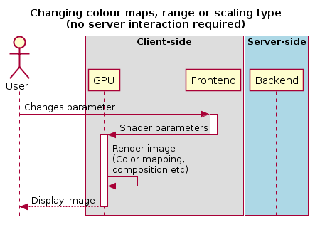

.. _changing-view-parameters:

Changing view parameters
------------------------

Contours must be re-calculated by the server when the contour parameters (levels, mode or smoothness) change.

.. image:: images/updating_contour_parameters.png

However, as contour rendering is done on the frontend, any changes to the contour rendering configuration (visibility, opacity, thickness, colour, line style) do not require any server interaction. Similarly for raster images: As all the rendering is done on the frontend, any changes to the raster rendering configuration (colour map, range, scaling type) do not require any interaction between frontend and backend:

