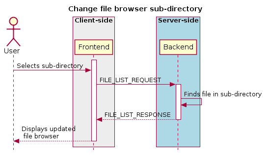
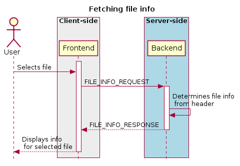
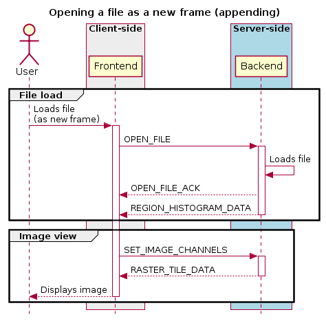
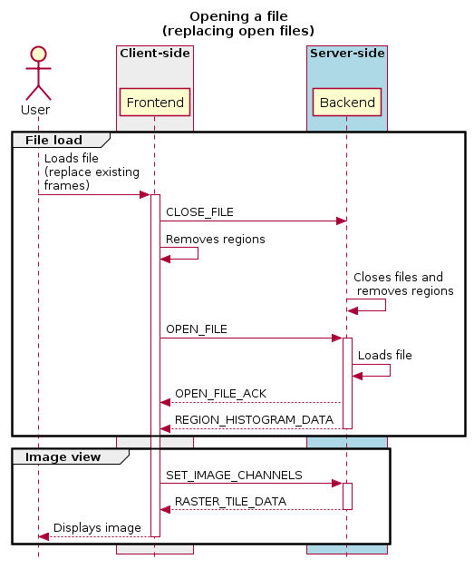

.. _file-browsing:

File browsing
-------------

The file browser displays a list of files in the selected directory, along with some basic information on each file (type, size) and a list of subdirectories. If a file contains multiple HDUs (or equivalent), a list of HDU names is included. If a file is selected in the file browser, additional information is shown. A specific HDU of a file can be selected. When a subdirectory is selected, the file list is fetched for that subdirectory. When a file is loaded, the default image view is requested. A file can be loaded as a raster or contour image (not currently implemented), and can be appended to the current list of open files, or can replace all open files, in which case the frontend must first close all files using the :ref:`CLOSE_FILE <closefile>` message with ``file_id = -1``. Individual open files can be removed from the file list by calling :ref:`CLOSE_FILE <closefile>` with an appropriate ``file_id`` field.

