.. _h.760gw3x2yqqk:

CARTA Interface Control Document
================================

Date: 19 May 2020

Authors: Angus Comrie and Rob Simmonds

Version: 15.0.0

ICD Version Integer: 15

CARTA Target: Version 1.4

**Changelog**

``0.1.7  (30/08/18):`` Added optional field ``channel_histogram_data``
to the image view message

``0.1.8  (07/09/18):`` Added ``computed_entries`` map to the File Info
Extended message

``0.1.9  (10/09/18): Changed computed_entries`` map to an array of
``HeaderEntry`` messages

``0.1.10 (10/09/18):`` Added optional field ``spatial_requirements`` to
the ``SET_CURSOR`` message

``0.1.11 (20/09/18):`` Added ``file_id`` field to ``SET_REGION`` and
fixed control points typo

``0.1.12 (18/10/18):`` Deprecated ``channel_vals`` field in
``SPECTRAL_PROFILE_DATA``

``0.1.13 (30/11/18):`` Added details on per-cube histogram calculations

``0.1.14 (07/02/19):`` Added ``$BASE`` folder placeholder

``0.1.15 (05/03/19):`` Added target version info

``0.1.16 (25/03/19):`` Removed ``stokes``, ``channel_min`` and
``channel_max`` fields from ``SET_REGION``, and changed
``StatisticsValue`` ``value`` field to a ``double`` type.

``0.1.17 (27/03/19):`` Added ``NumPixels`` and ``NanCount`` stats types

``0.1.18 (28/03/19):`` Changed rotation units from radians to degrees

``0.2.0  (07/05/19):`` Changed message header information, adjusted
stats enum values, added double value support for spectral profile

``0.2.1  (09/05/19):`` Added feature flag enums as well as event type
enums. Updated animation information and sequence diagrams to include
flow control

``0.2.2  (14/05/19):`` Added information on tiled rendering

``4.0.0  (02/07/19):`` Expanded sequence diagrams and text on tiled
rendering and animation. Changed version numbering to match ICD version
integer

``4.0.1  (04/07/19):`` Fixed incorrect sequence diagrams for file
loading

``5.0.0  (15/07/19):`` Switched to byte fields instead of repeated
float/double for efficiency reasons in spatial and spectral profile
messages

``6.0.0  (19/07/19):`` Animation ID and timestamps for ACKs

``7.0.0  (23/07/19):`` Region file browser and import/export messages

``7.0.1  (08/08/19):`` Region export coordinate type

``8.0.0  (21/08/19):`` Added messages for retrieving and setting user
preferences and layouts

``9.0.0  (17/10/19):`` Added/updated messages for contour parameters and
streaming

``10.0.0 (25/10/19):`` Updated messages for contour streaming

``11.0.0 (20/11/19):`` Added messages to resume the session and its ACK

``12.0.0 (18/02/20):`` Updated messages for tiled rendering usage during
animation

``13.0.0 (19/05/20):`` Updated messages for scripting service
information (WIP)

``14.0.0 (28/05/20):`` Updated messages for catalogs

``15.0.0 (04/07/20):`` Added date field to file info, reordered file
types alphabetically

``16.0.0 (??/07/20):`` Added sub-message for region style, replace
RegionProperties with map

.. _h.psxugp5f9v9f:

1. Introduction
===============

The CARTA application is designed in a server-client model, with the
backend (written in C++) communicating with the frontend (Web-based,
using HTML and JavaScript web frameworks) through an interface defined
in this document. While CARTA is required to support a number of file
formats (FITS, CASA, HDF5 and Miriad), throughout the document,
nomenclature will be defaulted to FITS files, such as when referring to
multiple HDUs in a file, and header entries.

Throughout this document, things that require some clarity, or are not
finalised are commented on in this font style.

.. _h.3alfbhbei8ai:

2. Context
==========

There are two distinct usage scenarios for frontend-backend
configuration in CARTA. Firstly, when used as a desktop application, the
frontend and backend both run locally. The backend is run as an
application that communicates with the frontend, which is presented to
the user as a desktop application in the form of an Electron-wrapped web
view
[`1 <https://www.google.com/url?q=https://electronjs.org/&sa=D&ust=1595980841122000&usg=AOvVaw1T_YFsV40apLmx90pkO8uw>`__].

The second usage scenario is that of a remote viewer, where the backend
is running on a remote server, while the frontend is loaded in the
user’s browser of choice (as long as that choice is Chrome, Firefox,
Safari or Edge) by visiting a URL associated with the remote server. A
third possible configuration is running the desktop Electron
application, while connecting to a specific server IP for remote data.
This is not a high priority, as most usage scenarios would be better
handled through accessing the frontend through a remote URL.

In both of these scenarios, communication between the frontend and
backend takes place over a standard WebSocket
[`2 <https://www.google.com/url?q=https://en.wikipedia.org/wiki/WebSocket&sa=D&ust=1595980841123000&usg=AOvVaw2_2I4xI6j4x8Pz6b8zoIug>`__]
communication channel, with message formats defined using protocol
buffers
[`3 <https://www.google.com/url?q=https://developers.google.com/protocol-buffers/&sa=D&ust=1595980841123000&usg=AOvVaw1BHzSVf8KTo-cO-WH_qXJV>`__],
based on the message structures defined in `Section
4.1 <#h.m3knt95uc9s>`__.

Image data is sent to the frontend as either uncompressed or compressed
floating point data. The frontend can request which type of data is sent
from the backend, which compression library to use, and what compression
quality to use. Two lossy floating-point compression libraries are
supported: ZFP
[`4 <https://www.google.com/url?q=https://github.com/LLNL/zfp&sa=D&ust=1595980841124000&usg=AOvVaw05URYQ82oXctGj2sTtbMek>`__]
and SZ
[`5 <https://www.google.com/url?q=https://github.com/disheng222/SZ&sa=D&ust=1595980841124000&usg=AOvVaw28cbknTYTzWMg7eKs7-zhO>`__].
A general investigation of the compression performance of these two
libraries shows that ZFP is consistently faster, while SZ offers
slightly better compression ratios at the expense of compression and
decompression speed. The current implementation of the SZ library is not
thread safe, meaning that compression on the backend would have to be
implemented sequentially. Note that, due to the frontend’s use of web
workers to decompress data, this limitation is overcome, as each web
worker operates in a separate execution space. ZFP should be preferred
when network bandwidth is sufficient. In the case of a desktop
application, uncompressed data or very high quality ZFP compressed data
should be favoured. When using uncompressed data, the FP32 floating
point data is copied directly to and from the uint8 array specified by
``TileData`` (using 4 uint8 entries per 32-bit floating point entry).

--------------

.. _h.sh609pjox520:

.. _h.xibteqnwgrp1:

3. Behaviour
============

.. _h.wfvt4qo2aez:

3.1 Connection
--------------

Connection takes place via the WebSockets protocol, and is initiated as
soon as the frontend page is successfully loaded. Upon connection, the
frontend registers itself to the backend using the ``REGISTER_VIEWER``
message and retrieves a new session ID, server capabilities and user
preferences through ``REGISTER_VIEWER_ACK``. It then requests the list
of files in the default directory. If the connection is dropped, the
frontend re-registers itself to the server, but passes through the
original session ID. The server should attempt to resume this session,
but if not possible, will generate a new session ID for the client. In
addition to the session ID, the frontend can pass through an optional
API key, which can be used to determine basic permissions and
user-related settings.

A connection heartbeat is established by the server-initiated ping/pong
sequence defined by the WebSocket protocol. In addition to this, a
client-initiated ping/pong sequence is produced by empty messages being
sent by the frontend periodically. The backend keeps track of the time
since each connected client last initiated the ping/pong sequence, and
makes timeout decisions based on this value.

When the frontend is intentionally closed, by closing the associated app
or web page, the frontend closes the WebSocket connection gracefully,
and the backend can then remove the associated session. When the
frontend is closed in error, or the backend determines that a connection
is timed out, the backend should maintain the session for an appropriate
period, so that it can be resumed when the frontend reconnects. The
frontend should attempt to reconnect with the same session ID when a
connection is dropped. If the backend responds with a session type set
to ``RESUMED``, the frontend will attempt to resume the session by
sending a list of files, along with their associated regions in a
``RESUME_SESSION`` message.

|image0|

|image1|

A scripting service is available. When enabled, the backend allows for
gRPC connections on a specified port. The gRPC connection is used to
simply ferry scripting commands from a scripting service, such as a
python package, to the frontend. The frontend then parses the scripting
commands from the incoming ``SCRIPTING_REQUEST`` message, executes the
required code and responds with a ``SCRIPTING_RESPONSE`` message, which
indicates the success of the scripting command, as well as the response
in JSON format. Each incoming scripting request includes a unique ID,
which is passed back in the scripting response, in order to uniquely
match scripting requests to their responses.

.. _h.58ke5sat0rfq:

3.2 File browsing
-----------------

The file browser displays a list of files in the selected directory,
along with some basic information on each file (type, size) and a list
of subdirectories. If a file contains multiple HDUs (or equivalent), a
list of HDU names is included. If a file is selected in the file
browser, additional information is shown. A specific HDU of a file can
be selected. When a subdirectory is selected, the file list is fetched
for that subdirectory. When a file is loaded, the default image view is
requested. A file can be loaded as a raster or contour image (not
currently implemented), and can be appended to the current list of open
files, or can replace all open files, in which case the frontend must
first close all files using the ``CLOSE_FILE`` message with
``file_id = -1``. Individual open files can be removed from the file
list by calling ``CLOSE_FILE`` with an appropriate ``file_id`` field.

|image2|

|image3|

|image4|

|image5|

.. _h.u73x4b49hzwi:

3.3 Data cube navigation
------------------------

The frontend can change the displayed channel and Stokes parameter by
issuing the ``SET_IMAGE_CHANNELS`` command. When an image is opened, the
frontend will send a ``SET_IMAGE_CHANNELS`` with the first channel and
Stokes parameter. The frontend subscribes to all ``RASTER_TILE_DATA``
messages.

Tiled rendering splits the image into individual square tiles
(defaulting to 256 pixels in width), and renders the image progressively
as tiles arrive from the backend. This is more efficient when exploring
a large image, as it reuses data when panning and zooming around the
image. Images are downsampled by a power of 2.

In addition, contour rendering can be used on files. The contours for an
entire channel are generated when the frontend sends the
``SET_CONTOUR_PARAMETERS`` command. The frontend subscribes to all
``CONTOUR_IMAGE_DATA`` messages. Currently, contour renders are
automatically updated when the user changes channel or plays an
animation. Contours are delivered in separate chunks by the backend, so
that the user can see the contours as they are delivered to the
frontend, and can get an idea of how long the contour fetching will
take.

.. _h.ps0vfolqup99:

3.3.1 Zooming and panning
~~~~~~~~~~~~~~~~~~~~~~~~~

The frontend can request specific tiles of an image to be delivered.
Tiles are specified using the widely used a `tiled web
map <https://www.google.com/url?q=https://en.wikipedia.org/wiki/Tiled_web_map&sa=D&ust=1595980841128000&usg=AOvVaw2G6xBYweYBuo5EVxgyI5Ws>`__
convention (commonly used in GIS and online image viewer software). Each
tile is defined by three coordinates: The layer, x and y coordinates.
The zeroth layer consists of the entire image, down-sampled until it is
stored in a single tile, with both width and height less than or equal
to a chosen tile size (defaulting to 256 pixels, but this may increase
in future to 512 pixels for large format screens). The tile size must be
a multiple of four, due to the ZFP algorithm’s block size. Each
subsequent layer doubles in width and height, to the point where the
highest layer (*N*) contains the entire image in full resolution, split
into fixed-size tiles (tiles along the right and top edges of the image
will have reduced width and height respectively).

Tile coordinates (``layer``, ``x`` and ``y``) are encoded into a single
32-bit integer before sending. There are two primary reasons for this:

-  Using a struct as a key in a map on either frontend or backend would
   be more complicated, and require a custom hash function. JavaScript
   ``Map`` objects do not support this. Storing tiles within a
   map-of-maps-of-maps would be less efficient.
-  Encoding and decoding an array of structs in a protocol buffer object
   would be less efficient in terms of CPU time and network storage

The encoded integer consists of:

-  12 bits for the X and Y coordinate. This limits the implementation to
   at most 4096 tiles along either axis. With a default tile size of 256
   pixels, this means images must be smaller than 1.04 million pixels in
   width and height.
-  7 bits for the layer coordinate. This limits the implementation to
   128 layers. However, this limitation is artificial, since at most 12
   layers will be required, given the above limitation of 4096 tiles
-  1 bit left over, because JavaScript bit shifting is done on signed
   integers, rather than unsigned

Encoding and decoding is a simple and lightweight process using some bit
shifting. A single line JavaScript function to encode is:

``(x, y, layer) => (layer << 24) | (y << 12) | x;``

When a user zooms or pans, the frontend sends the ``ADD_REQUIRED_TILES``
command to the backend. The frontend may debounce, throttle or delay
sending tiles to the backend, in order to optimise delivery and avoid
sending stale tiles. The order of the list of tiles supplied to
``ADD_REQUIRED_TILES`` determines the order in which the backend
delivers tiles. If subsequent ``ADD_REQUIRED_TILES`` messages arrive
while the backend is still delivering tiles, the most recent tile list
is prioritised.

Another route for optimisation available to the frontend is
``REMOVE_REQUIRED_TILES``, which allows the frontend to explicitly
indicate that certain tiles are no longer required. If any of these
tiles are yet to be delivered to the frontend, the backend can optimise
tile delivery by removing them from the queue of titles to be delivered.

Tile data is delivered by the backend using the ``RASTER_TILE_DATA``
stream. This allows the backend to send one or more raster tiles with
the same compression format and quality to the frontend. Each time a
tile is delivered to the frontend, the image is re-rendered.

|image6|

.. _h.dds0t5d46snc:

3.3.2 Channel navigation
~~~~~~~~~~~~~~~~~~~~~~~~

When changing channels via a ``SET_IMAGE_CHANNELS`` message, the
frontend includes an initial list of required tiles. These tiles are
then delivered individually by the backend. Unlike the case when zooming
and panning, the frontend will wait for all required tiles to be
delivered before displaying an image when switching channels. When
receiving a ``SET_IMAGE_CHANNELS`` message, the backend will also send
the new channel histogram via the ``REGION_HISTOGRAM_DATA`` stream.

In general, one image view command will correspond to a subsequent image
data stream message. However, changing the image channel will result in
a subsequent image data stream message, as well as any relevant updated
statistics, histograms or profile data.

|image7|

.. _h.8n2v2rbr3275:

3.3.3 Animation
~~~~~~~~~~~~~~~

An animation can be played back by issuing the ``START_ANIMATION``
command. This command encapsulates all the different animation stepping
and bounds parameters, in order to allow the backend to perform frame
calculations and deliver image data to the front. After the the
``START_ANIMATION`` command has been issued, the backend sends images
and analysis results to the frontend at a regular interval. When the
user stops an animation, the frontend sends the ``STOP_ANIMATION``
command, which includes information on the current image’s channels, so
that the backend can be sure that the frontend channel state is the same
as that of the backend. If the last sent frame does match the frontend
channel state, the backend adjusts channels again. In order to prevent
the backend from sending too many animation frames, some basic flow
control is provided through ``ANIMATION_FLOW_CONTROL`` message. This is
sent from the frontend to the backend to indicate the latest frame
received, preventing the backend from queuing up too many frames. The
``START_ANIMATION`` command includes an ``ADD_REQUIRED_TILES``
sub-message, specifying the required tiles and compression type to be
used in the animation. The backend includes an animation ID field in
``START_ANIMATION_ACK`` in order to allow the frontend to differentiate
between frames of previous animations and the latest animation.

|image8|

Images are sent as tiled data. In order to keep the image view channel
and full image histogram synchronised, the ``RASTER_IMAGE_DATA`` message
includes a ``REGION_HISTOGRAM_DATA`` object, containing the channel
histogram for the new channel. During animation playback, each animation
step will result in image data stream messages, as well as any relevant
analytics updates. If zooming or panning occurs during animation, a
``SET_IMAGE_VIEW`` message is sent to the backend, updating the view
bounds. These new bounds are used in the next frame generated by the
backend.

--------------

.. _h.3z1uylqiabgw:

3.4 Changing view parameters
----------------------------

Contours must be re-calculated by the server when the contour parameters
(levels, mode or smoothness) change.

|image9|

However, as contour rendering is done on the frontend, any changes to
the contour rendering configuration (visibility, opacity, thickness,
colour, line style) do not require any server interaction. Similarly for
raster images: As all the rendering is done on the frontend, any changes
to the raster rendering configuration (colour map, range, scaling type)
do not require any interaction between frontend and backend:

|image10|

--------------

.. _h.wvuye0qtk32h:

.. _h.851wh0pxqqcn:

3.5 Region selection and statistics
-----------------------------------

.. _h.myeas9ynh2um:

3.5.1 Region creation
~~~~~~~~~~~~~~~~~~~~~

Regions can be created, removed and updated. Any profiles or statistics
data associated with a region flow from the backend to the server
whenever an update is required. Updates may be required (a) when a
region is created or updated; (b) when the image channel is explicitly
switched to a different channel or Stokes parameter using
``SET_IMAGE_CHANNELS`` or (c) when an animation playback results in the
image view being updated implicitly.

In addition, the backend may choose to provide partial region statistics
or profile updates if the calculations are time-intensive. When creating
a region, the ``region_id`` field of ``SET_REGION`` is less than zero:
the backend generates the unique region_id field, and returns it in the
acknowledgement message.

|image11|

|image12|

.. _h.s7l4h2dtujcf:

3.5.2 Cursor updates
~~~~~~~~~~~~~~~~~~~~

As viewing profiles based on the position of the cursor is a very common
use case, a separate control message is used specifically for this
purpose, and does not require the definition of any additional region.
The cursor-based region has a ``region_id`` field value of zero, and is
defined as a point-type region. The X and Y coordinates of the region
can only be updated via the ```SET_CURSOR`` <#h.phs5ttglm95>`__ command,
while the channel and Stokes coordinates are automatically updated by
the backend whenever the image view is changed.

|image13|

.. _h.e098rxpenog1:

3.5.3 Region requirements
~~~~~~~~~~~~~~~~~~~~~~~~~

Each region can have analytical data requirements associated. For
example, the user may wish to display the Z-profile of a particular
region, while displaying the X- and Y-profiles of the cursor region.
Whenever an analytical widget is added or removed in the frontend, the
frontend must update the requirements associated with that region using
the relevant command:

-  ``SET_SPECTRAL_REQUIREMENTS`` for spectral profiler widgets
-  ``SET_SPATIAL_REQUIREMENTS`` for spatial profiler widgets
-  ``SET_STATS_REQUIREMENTS`` for stats info displays
-  ``SET_HISTOGRAM_REQUIREMENTS`` for histograms plot widgets

After each requirements update, the backend should then assess the new
requirements to determine whether any new or updated analytical data
needs to be sent to the frontend. As an example: adding a spectral
profile widget on the frontend and setting its requirements will mean
that the region it is associated with now has an additional requirement,
and the frontend requires new data. As such, the backend will calculate
the required spectral profile and send it using
``SPECTRAL_PROFILE_DATA``. However, removing the spectral profile widget
on the frontend will now remove that requirement, but no new
``SPECTRAL_PROFILE_DATA`` message is needed from the frontend.

|image14|

|image15|

If a region’s parameters are changed, the backend determines which
calculations need to be updated, based on the region’s requirements set,
and any required data is sent to the frontend through a new data stream
message:

|image16|

When all files are closed, regions associated with that file are
removed, both on the frontend and on the backend. When only a single
frame is closed, the regions persist.

|image17|

.. _h.kwxocwxdru9g:

3.5.4 Per-cube histograms
~~~~~~~~~~~~~~~~~~~~~~~~~

As users may wish to use a histogram generated from the entire cube to
choose their render bounds, the backend needs to support the calculation
of a histogram on a per-cube as well as per-slice basis. A per-cube
histogram is requested through the ``SET_HISTOGRAM_REQUIREMENTS``
message, with the region ID set to -2. As per-cube histograms may take a
long time to calculate, there are additional requirements over and above
per-slice histograms.

The backend should deliver results from the histogram calculation at
regular intervals. As the histogram. As the histogram calculation
consists of a large number of separable calculations (reading through
individual slices to determine min/max, reading through individual
slices to fill the histogram bins), the backend can split the
calculation up into smaller tasks, and deliver cumulative results to the
frontend.

|image18|

The backend should be able to cancel the histogram calculation when
receiving a specific message from the frontend. By sending a second
``SET_HISTOGRAM_REQUIREMENTS`` message to the backend, with the region
ID set to -2 and an empty histogram list, the frontend can indicate to
the backend that the per-cube histogram is no longer required, and the
backend can cancel the calculation.

|image19|

.. _h.2r0bdrhq0hz:

3.6 Data streaming
------------------

While some data flows can be described by a simple request/response
approach, such as retrieving file lists or file information, other data
flows require an asynchronous data stream approach. This need arises
from situations where a single state change command corresponds to more
than one response from the backend. For example, changing image channel
would require each spatial profile associated with the active image
channel to be updated, possibly resulting in more than one
```SPATIAL_PROFILE_DATA`` <#h.s1l0povv67tc>`__ messages. Moving a region
would require updating any analytics associated with the region. It is
the backend’s responsibility to correctly determine which analytic data
needs to be updated whenever a control message is sent. It is essential
that the backend only recalculates and sends data when needed. In order
to do this, the backend must keep track of any updates to region
requirements, and use these requirements to determine whether updates
are needed. Region requirements will reflect the current frontend UI
configuration. Changes to the frontend UI configuration (such as
changing between “average” and “max” on a spectral profile widget) will
result in new region requirements being sent to the backend, which will
then be processed, resulting in new data being sent to the frontend when
required.

Some examples of possible resultant data streams for control messages
are given below:

-  ``SET_IMAGE_CHANNELS``: Changing either the channel or the Stokes
   parameter would require new image data to be sent, for both raster
   and contour images. Changing from one channel to another in the same
   Stokes cube could result in histograms, spatial profiles or region
   stats to require updating. Changing to a new stokes cube could also
   require spectral profiles to be updated. These updates will depend on
   the defined regions and defined region requirements.
-  ``START_ANIMATION``: Starting an animation will require new image
   data for each frame. In addition, since the animation playback may be
   across file, Stokes or channel parameters, the same data streams as
   those arising from ``SET_IMAGE_CHANNELS`` can occur.
-  ``SET_CURSOR``: Updating the cursor position is a special case of
   updating a region. As the cursor position is a point region, only
   spectral data and spatial data can require an update.
-  ``SET_REGION``: Creating a region will not result in any data
   streams, as the region’s requirements will be empty by default.
   However, updating a regions parameters (other than region name) could
   result in spatial profiles (for open regions), spectral profiles,
   region stats and histograms (for closed and point regions) to be
   updated.
-  ``SET_STATS_REQUIREMENTS``: Updating stats requirements for a region
   can result in region stats data being updated.
-  ``SET_HISTOGRAM_REQUIREMENTS``: Updating histogram requirements for a
   region (either by updating the channel required for the histogram or
   by changing the histogram bin number) can result in histogram data
   being updated.
-  ``SET_SPATIAL_REQUIREMENTS``: Updating spatial profile requirements
   for a region can result in spatial profile data being updated.
-  ``SET_SPECTRAL_REQUIREMENTS``: Updating spectral profile requirements
   for a region (either by changing the coordinate required, such as
   “Qz” or “Uz”, or by changing the statistic type used to generate the
   profile) can result in spectral profile data being updated.
-  ``SET_CONTOUR_PARAMETERS``: Updating contour parameters for a file
   will result in new contour image data being required.

.. _h.q86xtkfulkg1:

3.7 User preferences
--------------------

If the backend supports the ``USER_PREFERENCES`` server feature flag,
the frontend will expect all the user’s preferences (default settings,
color maps, interaction preferences and others) to be included in the
``REGISTER_VIEWER_ACK`` message. Changes to the user preferences can be
made by the frontend through the ``SET_USER_PREFERENCES`` control
message. Each preference to be updated, along with the updated value, is
stored as a map. User preference entries can be removed from the server
by sending a ``SET_USER_PREFERENCES`` message with a map of preference
keys with empty values.

If the backend supports the ``USER_LAYOUTS`` server feature flag, the
frontend will expect all the user’s custom UI layouts to be included in
the ``REGISTER_VIEWER_ACK`` message. Changes to individual layouts
(adding, updating or removing) are updated through the
``SET_USER_LAYOUT`` control message.

.. _h.2sfmsvkqco5e:

3.8 Resume the session
----------------------

The basic idea is that, when the frontend reconnects to the backend
(with ``REGISTER_VIEWER``), it would also send some state information,
such as:

-  list of open files, along with their IDs and the current channels and
   stokes
-  list of regions for each file, along with all their properties

Users can choose whether to resume the session while reconnected. If
yes, then the backend would then reconstruct the session based on the
frontend's message, by opening files again, changing to the appropriate
channels, and so on, and then adding the regions and then set
requirements.

There are two use cases for resuming with an existing session ID, and a
third where resume is not possible.

#. Backend is restarted, frontend connects, frontend sends state
   information.

   #. Frontend sends ``REGISTER_VIEWER`` with session_id > 0.
   #. Restarted backend has no session_ids, ``REGISTER_VIEWER_ACK`` sets
      session_type=RESUMED\ *.* Backend creates new Session with given
      session_id (On Connect).
   #. Frontend sends state to backend, i.e., sends ``RESUME_SESSION``
      message with state information, backend responds with
      ``RESUME_SESSION_ACK``.
   #. Backend sets state in newly-created Session.

#. Network connection drops, frontend reconnects to backend with
   existing session id.

   #. While the network connection drops. It seems the uWebsocket has a
      default timeout setting for 15,000 ms (need to verify). For the
      new version of uWebsocket, we can set the timeout via the variable
      “\ *.idleTimeout”*. On Disconnect is called after the timeout and
      then backend deletes Session.
   #. Frontend sends ``REGISTER_VIEWER`` with session_id > 0.
   #. Backend has session_id, ``REGISTER_VIEWER_ACK`` sets
      session_type=RESUMED. Frontend sends state to backend with
      ``RESUME_SESSION``, and backend responses with
      ``RESUME_SESSION_ACK``.
   #. Backend sets state in existing Session, requirements trigger
      sending data streams (possibly cached).

#. Frontend is restarted, has no existing session id so cannot resume
   even though backend continues.

   #. Frontend sends ``REGISTER_VIEWER`` with session_id = 0.
   #. Backend creates a new Session, ``REGISTER_VIEWER_ACK`` sets
      session_type=NEW.
   #. The Session will be deleted immediately while the frontend is
      restarted.

.. _h.uzmvi2hbzbxe:

3.9 Catalog overlay
-------------------

.. _h.t96bdjd8vv86:

3.9.1 Sequence Diagrams
~~~~~~~~~~~~~~~~~~~~~~~

#. Catalog file list\ |image20|
#. Catalog file info\ |image21|
#. Opening catalog file\ |image22|
#. Catalog file data stream\ |image23|
#. Closing catalog file\ |image24|

.. _h.4066jwrwicfh:

3.10 Moments generator
----------------------

The moment generator should allow users to generate moment images from a
cube interactively with the GUI. The interactivity should happen with a
spectral line profile plot as usually we need information from spectral
line profiles (line spectral/intensity distributions) to decide the
control parameters of the moment generator. This could happen with the
existing spectral profile widget, or, with a dedicated moment generator
widget/dialogue with a spectral line profile plot.

CARTA should provide the following kinds of moments (sensible name in
bold) as supported by CASA:

-  moments = -1 - **mean value of the spectrum**
-  moments = 0 - **integrated value of the spectrum**
-  moments = 1 - **intensity weighted coordinate**; traditionally used
   to get "velocity fields"
-  Moments = 2 - **intensity weighted dispersion of the coordinate**;
   traditionally used to get "velocity dispersion"
-  moments = 3 - **median value of the spectrum**
-  moments = 4 - **median coordinate**
-  moments = 5 - **standard deviation about the mean of the spectrum**
-  moments = 6 - **root mean square of the spectrum**
-  moments = 7 - **absolute mean deviation of the spectrum**
-  moments = 8 - **maximum value of the spectrum**
-  moments = 9 - **coordinate of the maximum value of the spectrum**
-  moments = 10 - **minimum value of the spectrum**
-  moments = 11 - **coordinate of the minimum value of the spectrum**

The newly generated moment images (multiple moments can be generated at
the same time) should be loaded and appended (and match spatially) in
CARTA. CARTA should also support the capability to export the images as
files in the following formats:

-  CASA image format
-  FITS image format
-  HDF5-IDIA schema image format (TBD; post v1.4)

We create temporary moment images in the backend. Then if users want to
keep the results, the “save image” option in the file menu should be
used where filename and file type can be defined. If users don’t do the
“save image” step, those images should be deleted when the session is
closed.

The interactivity with the spectral profile widget should include the
following:

#. Text fields to specify spectral ranges to generate moments. This
   includes:

-  Channel
-  Velocity
-  Frequency
-  Stokes

These text fields (except Stokes) are linked to the selection via the
cursor directly on the spectral plot. Users can drag on the spectral
plot to define a range in the spectral axis.

2. Text fields to define masks for the intensity values. Users can
   define a range of intensity values to be included in the moment
   calculations. For example, usually we will apply a threshold (e.g.,
   >= 5-sigma) to the cube to compute moment 1 and moment 2. These text
   fields are linked to the selection via the cursor directly on the
   spectral plot. Users can drag on the spectral plot to define
   thresholds for moments.

As image cubes might be extremely large, the moment generator in CARTA
should support an accurate progress bar (CASA provides "multiple" 0-100%
progress bars which is misleading and does not provide useful
information) and most importantly, the ability of cancellation.

Sequence diagrams for setting image moments and stopping moments
calculation are shown below:

|image25|

|image26|

.. _h.busj5lil4awd:

4. Layer descriptions
=====================

.. _h.m3knt95uc9s:

4.1 Application Layer
~~~~~~~~~~~~~~~~~~~~~

Interface communication messages fall into three overall categories:

-  **Control messages** (along with any associated acknowledgement
   responses), which are used to modify the state of the backend from
   the frontend. Example of this would be starting a new session, moving
   the cursor or updating region parameters. Each message from the
   frontend correspond to zero or one acknowledgement response from the
   backend. Message names for this category follow the naming convention
   ``MESSAGE_NAME`` and ``MESSAGE_NAME_ACK``
-  **Request messages** (along with the required responses), which are
   used to explicitly request information from the backend without
   explicitly changing the backend state. Examples of this would be
   requesting a file list. The frontend will wait for a response for
   each request of this type, and callbacks or promises will be used to
   execute code based on the returned response. As each request needs to
   be mapped to response, messages in this category must include a
   unique requestID entry. Each message from the frontend in this
   category corresponds to exactly one response from the backend.
   Message names for this category follow the naming convention
   ``MESSAGE_NAME_REQUEST`` and ``MESSAGE_NAME_RESPONSE``
-  **Data flow messages**, which flow from the backend to the frontend
   without an originating front end request. These messages are used for
   pushing updated data from the backend to the frontend. Examples of
   this type would be image data, region statistics, profile data and
   cursor values. The appropriate mechanism for dealing with these
   messages in the frontend is a observable/subscription-based approach.
   As there is no request/response combination for messages in this
   category, there is no prescribed message naming convention.

--------------

**Implementation note:** The backend should implement a command queue
for control messages, so that high priority messages are executed first,
and cause the backend to disregard any queued-up control messages that
are no longer relevant. As an example: moving the cursor across the
image will result in a large number of control messages being sent to
the backend. Each of these control messages could result in a data flow
message with new cursor and profile information, which may take some
time to calculate. If a file is closed by the frontend, the backend no
longer needs to process any remaining cursor messages relating to this
file, and those messages should be removed from the queue.

**Message definitions shown in** blue\ **are used for frontend ->backend
communication. Message definitions shown in** red **are used for
backend->frontend communication.**

.. _h.vi2c13c71rc7:

4.1.1 Control messages
^^^^^^^^^^^^^^^^^^^^^^

.. _h.z9b0zj29ibhg:

``REGISTER_VIEWER``
'''''''''''''''''''

Description
           

Registers the viewer with the backend. Responds with
``REGISTER_VIEWER_ACK.`` In future, may be the appropriate message to
include authentication options or settings that persist throughout the
session. A JWT could be an appropriate authentication string to pass
through at this point.

Fields
      

+--------------------------+------------+---------------------------+
| Name                     | Type       | Description               |
+==========================+============+===========================+
| ``session_id``           | ``uint32`` | Unique session ID         |
|                          |            | parameter (can be         |
|                          |            | generated using UUID      |
|                          |            | libraries). Passing in an |
|                          |            | existing session ID can   |
|                          |            | be used for resuming      |
|                          |            | sessions                  |
+--------------------------+------------+---------------------------+
| ``api_key``              | ``string`` | Optional user-specific    |
|                          |            | API key to be used for    |
|                          |            | basic authentication.     |
|                          |            | Could be an encrypted JWT |
|                          |            | for secure                |
|                          |            | authentication.           |
+--------------------------+------------+---------------------------+
| ``client_feature_flags`` | ``uint32`` | Optional feature bitflag  |
|                          |            | specifying client-side    |
|                          |            | feature set.              |
|                          |            | See\ `ClientFeatureFlags  |
|                          |            | <#h.im7a1pmk1f4f>`__\ for |
|                          |            | details                   |
+--------------------------+------------+---------------------------+

--------------

.. _h.gebjowaw6mor:

``REGISTER_VIEWER_ACK``
'''''''''''''''''''''''

.. _description-1:

Description
           

Acknowledgement response for ``REGISTER_VIEWER``. Informs the frontend
whether the session was correctly.

.. _fields-1:

Fields
      

+----------------------+----------------------+----------------------+
| Name                 | Type                 | Description          |
+======================+======================+======================+
| ``session_id``       | ``uint32``           | Unique session ID    |
+----------------------+----------------------+----------------------+
| ``success``          | ``bool``             | Defines whether the  |
|                      |                      | ``REGISTER_VIEWER``  |
|                      |                      | command was          |
|                      |                      | successful           |
+----------------------+----------------------+----------------------+
| ``message``          | ``string``           | Error message (if    |
|                      |                      | applicable)          |
+----------------------+----------------------+----------------------+
| ``session_type``     | ``enum Sess          | Defines the type of  |
|                      | ionType {    NEW = 0 | session established. |
|                      | ;    RESUMED = 1;}`` |                      |
+----------------------+----------------------+----------------------+
| ``se                 | ``uint32``           | Optional feature     |
| rver_feature_flags`` |                      | bitflag specifying   |
|                      |                      | server-side feature  |
|                      |                      | set.                 |
|                      |                      | See\ `Ser            |
|                      |                      | verFeatureFlags <#h. |
|                      |                      | 6wen0ukf0xd>`__\ for |
|                      |                      | details              |
+----------------------+----------------------+----------------------+
| ``user_preferences`` | ``map<key: stri      | Map of user          |
|                      | ng, value: string>`` | preferences          |
|                      |                      | retrieved from the   |
|                      |                      | server database. If  |
|                      |                      | this is empty and    |
|                      |                      | the server does not  |
|                      |                      | have the             |
|                      |                      | ``USER_PREFERENCES`` |
|                      |                      | feature flag set,    |
|                      |                      | then the user        |
|                      |                      | preferences are read |
|                      |                      | from the browser     |
|                      |                      | storage instead.     |
+----------------------+----------------------+----------------------+
| ``user_layouts``     | ``map<key: stri      | Map of user layouts  |
|                      | ng, value: string>`` | retrieved from the   |
|                      |                      | server database. If  |
|                      |                      | this is empty and    |
|                      |                      | the server does not  |
|                      |                      | have the             |
|                      |                      | ``USER_LAYOUTS``     |
|                      |                      | feature flag set,    |
|                      |                      | then the user        |
|                      |                      | layouts are read     |
|                      |                      | from the browser     |
|                      |                      | storage instead.     |
+----------------------+----------------------+----------------------+

.. _h.gusxs6aga46x:

``OPEN_FILE``
'''''''''''''

.. _description-2:

Description
           

Requests the opening of a specific file. Backend responds with
``OPEN_FILE_ACK``

.. _fields-2:

Fields
      

+-----------------+------------------------+------------------------+
| Name            | Type                   | Description            |
+=================+========================+========================+
| ``directory``   | ``string``             | Required directory     |
|                 |                        | name                   |
+-----------------+------------------------+------------------------+
| ``file``        | ``string``             | Required file name     |
+-----------------+------------------------+------------------------+
| ``hdu``         | ``string``             | Which HDU to load (if  |
|                 |                        | applicable). If left   |
|                 |                        | blank, the first HDU   |
|                 |                        | will be used.          |
+-----------------+------------------------+------------------------+
| ``file_id``     | ``int32``              | Which “file” slot to   |
|                 |                        | load the file into     |
|                 |                        | (when viewing multiple |
|                 |                        | files)                 |
+-----------------+------------------------+------------------------+
| ``render_mode`` | ``enum Rende           | The render mode to     |
|                 | rMode {  RASTER = 0;`` | use. For now, just     |
|                 | ``CONTOUR = 1;}``      | raster image and       |
|                 |                        | contour image.         |
+-----------------+------------------------+------------------------+
| ``tile_size``   | ``int32``              | Optionally indicate    |
|                 |                        | what the required tile |
|                 |                        | size is. If empty, the |
|                 |                        | default tile size is   |
|                 |                        | used. Tile size must   |
|                 |                        | be a multiple of four, |
|                 |                        | due to ZFP’s use of a  |
|                 |                        | 4x4 block size         |
+-----------------+------------------------+------------------------+

.. _h.20daqjgvxgug:

``OPEN_FILE_ACK``
'''''''''''''''''

.. _description-3:

Description
           

Response for ``OPEN_FILE``. Also supplies file information

.. _fields-3:

Fields
      

+----------------------+----------------------+----------------------+
| Name                 | Type                 | Description          |
+======================+======================+======================+
| ``success``          | ``bool``             | Defines              |
|                      |                      | whether\             |
|                      |                      | ```OPEN_FILE`` <#h.g |
|                      |                      | usxs6aga46x>`__\ was |
|                      |                      | successful           |
+----------------------+----------------------+----------------------+
| ``message``          | ``string``           | Error message (if    |
|                      |                      | applicable)          |
+----------------------+----------------------+----------------------+
| ``file_id``          | ``int32``            | Which file slot the  |
|                      |                      | file was loaded into |
|                      |                      | (when viewing        |
|                      |                      | multiple files)      |
+----------------------+----------------------+----------------------+
| ``file_info``        | ``FileInfo``         | Basic file info. If  |
|                      |                      | the file has more    |
|                      |                      | than one HDU, only   |
|                      |                      | the loaded HDU       |
|                      |                      | should appear in the |
|                      |                      | ``HDU_list`` field   |
+----------------------+----------------------+----------------------+
| ``                   | ``FileInfoExtended`` | Extended file info   |
| file_info_extended`` |                      |                      |
+----------------------+----------------------+----------------------+
| ``                   | ``uint32``           | Optional bitflags    |
| file_feature_flags`` |                      | specifying feature   |
|                      |                      | flags of the file    |
|                      |                      | being opened.        |
|                      |                      | Examples of this are |
|                      |                      | whether the file     |
|                      |                      | supports efficient   |
|                      |                      | Z-profile reads, or  |
|                      |                      | has cached           |
|                      |                      | histograms.          |
|                      |                      | See\ `F              |
|                      |                      | ileFeatureEnum <#h.i |
|                      |                      | gqs91qlyb7r>`__\ for |
|                      |                      | details              |
+----------------------+----------------------+----------------------+
| ``tile_size``        | ``int32``            | Tile size of tile    |
|                      |                      | data delivered for   |
|                      |                      | this file            |
+----------------------+----------------------+----------------------+

--------------

.. _h.ah8gp2kq1hun:

``CLOSE_FILE``
''''''''''''''

.. _description-4:

Description
           

Instructs the backend to close a file with a given file ID

.. _fields-4:

Fields
      

+-------------+-----------+------------------------------------------+
| Name        | Type      | Description                              |
+=============+===========+==========================================+
| ``file_id`` | ``int32`` | Which “file” slot to close. If this      |
|             |           | value is negative, all files are closed  |
|             |           | and regions are removed.                 |
+-------------+-----------+------------------------------------------+

.. _h.regyxdq3ju35:

``ADD_REQUIRED_TILES``
''''''''''''''''''''''

.. _description-5:

Description
           

Provides a list of tiles that are required for the specified file

.. _fields-5:

Fields
      

+----------------------+----------------------+----------------------+
| Name                 | Type                 | Description          |
+======================+======================+======================+
| ``file_id``          | ``int32``            | The file ID that the |
|                      |                      | view corresponds to  |
+----------------------+----------------------+----------------------+
| ``tiles``            | ``int32[]``          | The list of tiles    |
|                      |                      | required, in encoded |
|                      |                      | coordinates. Stored  |
|                      |                      | in order of          |
|                      |                      | priority.            |
+----------------------+----------------------+----------------------+
| ``compression_type`` | `                    | The compression      |
|                      | `enum {  NONE = 0;`` | algorithm used.      |
|                      | ``ZFP =              |                      |
|                      | 1;  SZ = 2;``\ ``}`` |                      |
+----------------------+----------------------+----------------------+
| ``c                  | ``float``            | Compression quality  |
| ompression_quality`` |                      | switch. Only         |
|                      |                      | applicable for       |
|                      |                      | compressed raster    |
|                      |                      | images.              |
+----------------------+----------------------+----------------------+

.. _h.llk00i4m05nu:

``REMOVE_REQUIRED_TILES``
'''''''''''''''''''''''''

.. _description-6:

Description
           

Provides a list of tiles that are no longer required for the specified
file and can be safely discarded by the backend

.. _fields-6:

Fields
      

+-------------+-------------+----------------------------------------+
| Name        | Type        | Description                            |
+=============+=============+========================================+
| ``file_id`` | ``int32``   | The file ID that the view corresponds  |
|             |             | to                                     |
+-------------+-------------+----------------------------------------+
| ``tiles``   | ``int32[]`` | The list of tiles to be explicitly     |
|             |             | removed from the, in encoded           |
|             |             | coordinates.                           |
+-------------+-------------+----------------------------------------+

.. _h.gwqdmfhrapyp:

``SET_IMAGE_CHANNELS``
''''''''''''''''''''''

.. _description-7:

Description
           

Sets the current image channel and Stokes parameter.

.. _fields-7:

Fields
      

+--------------------+----------------------+-----------------------+
| Name               | Type                 | Description           |
+====================+======================+=======================+
| ``file_id``        | ``int32``            | The file ID that the  |
|                    |                      | view corresponds to   |
+--------------------+----------------------+-----------------------+
| ``channel``        | ``int32``            | The image channel     |
|                    |                      | (Z-coordinate)        |
+--------------------+----------------------+-----------------------+
| ``stokes``         | ``int32``            | The image stokes      |
|                    |                      | parameter             |
+--------------------+----------------------+-----------------------+
| ``required_tiles`` | ``AddRequiredTiles`` | Tiles required by the |
|                    |                      | frontend when         |
|                    |                      | changing channels     |
+--------------------+----------------------+-----------------------+

.. _h.35zrt1gr6yxj:

``START_ANIMATION``
'''''''''''''''''''

.. _description-8:

Description
           

Starts an animation, as defined by the start, stop and step definitions.
Backend responds with ``START_ANIMATION_ACK``

.. _fields-8:

Fields
      

+--------------------+-----------------------+-----------------------+
| Name               | Type                  | Description           |
+====================+=======================+=======================+
| ``file_id``        | ``int32``             | Which file slot the   |
|                    |                       | animation describes.  |
+--------------------+-----------------------+-----------------------+
| ``first_frame``    | ``AnimationFrame      | The lower bound of    |
|                    |  {  channel: int32;`` | the animation when    |
|                    | ``stokes: int32;}``   | looping               |
+--------------------+-----------------------+-----------------------+
| ``start_frame``    | ``AnimationFrame``    | The starting point of |
|                    |                       | the animation.        |
+--------------------+-----------------------+-----------------------+
| ``last_frame``     | ``AnimationFrame``    | The upper bound of    |
|                    |                       | the animation when    |
|                    |                       | looping               |
+--------------------+-----------------------+-----------------------+
| ``delta_frame``    | ``AnimationFrame``    | The frame change step |
|                    |                       | for the animation.    |
|                    |                       | For example, a delta  |
|                    |                       | frame of              |
|                    |                       | ``{c                  |
|                    |                       | hannel=1, stokes=0}`` |
|                    |                       | would step through    |
|                    |                       | each channel in the   |
|                    |                       | file.                 |
+--------------------+-----------------------+-----------------------+
| ``frame_rate``     | ``int32``             | Frames per second     |
+--------------------+-----------------------+-----------------------+
| ``looping``        | ``boolean``           | Whether to loop the   |
|                    |                       | animation             |
|                    |                       | indefinitely.         |
+--------------------+-----------------------+-----------------------+
| ``reverse``        | ``boolean``           | Whether to reverse    |
|                    |                       | the animation         |
|                    |                       | direction when        |
|                    |                       | endFrame is reached.  |
+--------------------+-----------------------+-----------------------+
| ``required_tiles`` | ``AddRequiredTiles``  | Tiles required by the |
|                    |                       | frontend when         |
|                    |                       | changing channels     |
+--------------------+-----------------------+-----------------------+

.. _h.2lf9le5ng811:

``START_ANIMATION_ACK``
'''''''''''''''''''''''

.. _description-9:

Description
           

Response for ``START_ANIMATION``.

.. _fields-9:

Fields
      

+------------------+------------+------------------------------------+
| Name             | Type       | Description                        |
+==================+============+====================================+
| ``success``      | ``bool``   | Defines                            |
|                  |            | whether\ ```START_ANI              |
|                  |            | MATION`` <#h.35zrt1gr6yxj>`__\ was |
|                  |            | successful                         |
+------------------+------------+------------------------------------+
| ``message``      | ``string`` | Error message (if applicable)      |
+------------------+------------+------------------------------------+
| ``animation_id`` | ``int32``  | The animation ID of the new        |
|                  |            | animation                          |
+------------------+------------+------------------------------------+

.. _h.4psnm1h0049e:

``ANIMATION_FLOW_CONTROL``
''''''''''''''''''''''''''

.. _description-10:

Description
           

Used for informing the backend of which frames have been received

.. _fields-10:

Fields
      

+--------------------+--------------------+--------------------------+
| Name               | Type               | Description              |
+====================+====================+==========================+
| ``file_id``        | ``int32``          | Which file slot the      |
|                    |                    | animation describes.     |
+--------------------+--------------------+--------------------------+
| ``received_frame`` | ``AnimationFrame`` | The ending point of the  |
|                    |                    | animation.               |
+--------------------+--------------------+--------------------------+
| ``animation_id``   | ``int32``          | The animation ID that    |
|                    |                    | the flow control message |
|                    |                    | belongs to               |
+--------------------+--------------------+--------------------------+
| ``timestamp``      | ``int64``          | Timestamp at which the   |
|                    |                    | frame was received       |
+--------------------+--------------------+--------------------------+

.. _h.h1nxgp4bn1sx:

``STOP_ANIMATION``
''''''''''''''''''

.. _description-11:

Description
           

Stops a playing animation.

.. _fields-11:

Fields
      

+---------------+--------------------+------------------------------------------+
| Name          | Type               | Description                              |
+===============+====================+==========================================+
| ``file_id``   | ``int32``          | Which file slot the animation describes. |
+---------------+--------------------+------------------------------------------+
| ``end_frame`` | ``AnimationFrame`` | The latest flow control frame received.  |
+---------------+--------------------+------------------------------------------+

.. _h.phs5ttglm95:

``SET_CURSOR``
''''''''''''''

.. _description-12:

Description
           

Sets the current cursor position in image space coordinates. The cursor
defines a special case of a region (with region ID = 0), with a single
control point.

.. _fields-12:

Fields
      

+----------------------+----------------------+----------------------+
| Name                 | Type                 | Description          |
+======================+======================+======================+
| ``file_id``          | ``int32``            | Which file slot the  |
|                      |                      | cursor is moving     |
|                      |                      | over                 |
+----------------------+----------------------+----------------------+
| ``point``            | ``                   | XY-coordinates of    |
|                      | Point {  x: float;`` | cursor in image      |
|                      | ``y: float;}``       | space                |
+----------------------+----------------------+----------------------+
| ``sp                 | ``SET_SP             | Optional spatial     |
| atial_requirements`` | ATIAL_REQUIREMENTS`` | requirements message |
|                      |                      | applied at the same  |
|                      |                      | time as the cursor   |
|                      |                      | update.              |
+----------------------+----------------------+----------------------+

.. _h.h8gjsouxzb4y:

``SET_REGION``
''''''''''''''

.. _description-13:

Description
           

Creates or updates a region. Backend responds
with\ ```SET_REGION_ACK`` <#h.mx7hy8di73cf>`__

.. _fields-13:

Fields
      

+-----------------+----------------+---------------------------------+
| Name            | Type           | Description                     |
+=================+================+=================================+
| ``file_id``     | ``int32``      | File ID of the reference image, |
|                 |                | which defines the image space   |
|                 |                | of the control points.          |
+-----------------+----------------+---------------------------------+
| ``region_id``   | ``int32``      | Unique region ID. <= 0 if a new |
|                 |                | region is being created.        |
+-----------------+----------------+---------------------------------+
| ``region_info`` | ``RegionInfo`` | Submessage describing region    |
|                 |                | type, control points, and       |
|                 |                | rotation                        |
+-----------------+----------------+---------------------------------+

.. _h.mx7hy8di73cf:

``SET_REGION_ACK``
''''''''''''''''''

.. _description-14:

Description
           

Response for ``SET_REGION``.

.. _fields-14:

Fields
      

+---------------+------------+---------------------------------------+
| Name          | Type       | Description                           |
+===============+============+=======================================+
| ``success``   | ``bool``   | Defines                               |
|               |            | whether\ ```S                         |
|               |            | ET_REGION`` <#h.h8gjsouxzb4y>`__\ was |
|               |            | successful                            |
+---------------+------------+---------------------------------------+
| ``message``   | ``string`` | Error message (if applicable)         |
+---------------+------------+---------------------------------------+
| ``region_id`` | ``int32``  | The unique region ID. If the region   |
|               |            | is updated, this will be the same as  |
|               |            | the region ID specified               |
|               |            | in\ ``                                |
|               |            | `SET_REGION`` <#h.h8gjsouxzb4y>`__\ . |
|               |            | If a new region is being created, the |
|               |            | ID of the new region will be passed   |
|               |            | back.                                 |
+---------------+------------+---------------------------------------+

.. _h.ks01i4n5pc34:

``REMOVE_REGION``
'''''''''''''''''

.. _description-15:

Description
           

Removes a region.

.. _fields-15:

Fields
      

============= ========= ============================================
Name          Type      Description
============= ========= ============================================
``region_id`` ``int32`` Unique region ID of the region to be removed
============= ========= ============================================

.. _h.d7wa3i4x96qh:

``IMPORT_REGION``
'''''''''''''''''

.. _description-16:

Description
           

Requests the opening of a specific region file. Backend responds
with\ ``IMPORT_REGION_ACK``

.. _fields-16:

Fields
      

+----------------+--------------+------------------------------------+
| Name           | Type         | Description                        |
+================+==============+====================================+
| ``group_id``   | ``int32``    | the reference image (file id) in   |
|                |              | the group to apply the region(s)   |
|                |              | to                                 |
+----------------+--------------+------------------------------------+
| ``type``       | ``FileType`` | File type (4=REG, 5=CRTF)          |
+----------------+--------------+------------------------------------+
| ``directory``  | ``string``   | Directory name if importing from   |
|                |              | SERVER; blank if CLIENT            |
+----------------+--------------+------------------------------------+
| ``file``       | ``string``   | File name if importing from        |
|                |              | SERVER; blank if CLIENT            |
+----------------+--------------+------------------------------------+
| ``contents[]`` | ``string``   | File contents if importing from    |
|                |              | CLIENT (one line per string);      |
|                |              | blank if SERVER                    |
+----------------+--------------+------------------------------------+

.. _h.n1bgpt70bnez:

``IMPORT_REGION_ACK``
'''''''''''''''''''''

.. _description-17:

Description
           

Response for\ ``IMPORT_REGION``\ . Also supplies IDs and properties of
regions in file.

.. _fields-17:

Fields
      

+-------------------+-----------------------+-----------------------+
| Name              | Type                  | Description           |
+===================+=======================+=======================+
| ``success``       | ``bool``              | Defines               |
|                   |                       | whether\ `            |
|                   |                       | `IMPORT_REGION``\ was |
|                   |                       | successful            |
+-------------------+-----------------------+-----------------------+
| ``message``       | ``string``            | Error message (if     |
|                   |                       | applicable)           |
+-------------------+-----------------------+-----------------------+
| ``regions``       | ``map<int32           | For each region in    |
|                   | , RegionInfo``\ ``>`` | the file, return a    |
|                   |                       | unique region ID and  |
|                   |                       | the region parameters |
+-------------------+-----------------------+-----------------------+
| ``region_styles`` | ``map<int32,          | For each region in    |
|                   |  RegionStyle``\ ``>`` | the file, return a    |
|                   |                       | unique region ID and  |
|                   |                       | the region style      |
|                   |                       | parameters            |
+-------------------+-----------------------+-----------------------+

.. _h.iexn95l8v5kj:

``EXPORT_REGION``
'''''''''''''''''

.. _description-18:

Description
           

Requests exporting region(s); reverse of ``IMPORT_REGION.`` Backend
responds with\ ``EXPORT_REGION_ACK``

.. _fields-18:

Fields
      

+-------------------+-----------------------+-----------------------+
| Name              | Type                  | Description           |
+===================+=======================+=======================+
| ``type``          | ``FileType``          | File type (4=REG,     |
|                   |                       | 5=CRTF)               |
+-------------------+-----------------------+-----------------------+
| ``coord_type``    | ``Enum CoordinateT    | Control points        |
|                   | ype {    PIXEL = 0;`` | exported in pixel or  |
|                   | ``WORLD = 1;}``       | wcs coordinates       |
+-------------------+-----------------------+-----------------------+
| ``file_id``       | ``int32``             | File ID for           |
|                   |                       | coordinate system to  |
|                   |                       | use.                  |
+-------------------+-----------------------+-----------------------+
| ``region_styles`` | ``map<int32,          | Region IDs and style  |
|                   |  RegionStyle``\ ``>`` | parameters to export  |
+-------------------+-----------------------+-----------------------+
| ``directory``     | ``string``            | Directory name if     |
|                   |                       | exporting to SERVER;  |
|                   |                       | blank if CLIENT       |
+-------------------+-----------------------+-----------------------+
| ``file``          | ``string``            | File name if          |
|                   |                       | exporting to SERVER;  |
|                   |                       | blank if CLIENT       |
+-------------------+-----------------------+-----------------------+

.. _h.ynh4z171w4ha:

``EXPORT_REGION_ACK``
'''''''''''''''''''''

.. _description-19:

Description
           

Response for\ ``EXPORT_REGION``\ .

.. _fields-19:

Fields
      

+----------------+------------+--------------------------------------+
| Name           | Type       | Description                          |
+================+============+======================================+
| ``success``    | ``bool``   | Defines                              |
|                |            | whether\ ``EXPORT_REGION``\ was      |
|                |            | successful                           |
+----------------+------------+--------------------------------------+
| ``message``    | ``string`` | Error message (if applicable)        |
+----------------+------------+--------------------------------------+
| ``contents[]`` | ``string`` | File contents if exporting to        |
|                |            | CLIENT; blank if SERVER              |
+----------------+------------+--------------------------------------+

.. _h.fhk5gv91nn2v:

``SET_STATS_REQUIREMENTS``
''''''''''''''''''''''''''

.. _description-20:

Description
           

Sets which stats data needs to be streamed to the frontend when the
region is updated

.. _fields-20:

Fields
      

+---------------+---------------+------------------------------------+
| Name          | Type          | Description                        |
+===============+===============+====================================+
| ``file_id``   | ``int32``     | Which file slot the requirements   |
|               |               | describe                           |
+---------------+---------------+------------------------------------+
| ``region_id`` | ``int32``     | ID of the region that is having    |
|               |               | requirements defined. If a region  |
|               |               | ID of -1 is given, this            |
|               |               | corresponds to the entire 2D       |
|               |               | image.                             |
+---------------+---------------+------------------------------------+
| ``stats[]``   | ``StatsType`` | List of required stats             |
+---------------+---------------+------------------------------------+

.. _h.t18lsmc1msfy:

``SET_HISTOGRAM_REQUIREMENTS``
''''''''''''''''''''''''''''''

.. _description-21:

Description
           

Sets which histogram data needs to be streamed to the frontend when the
region is updated

.. _fields-21:

Fields
      

+------------------+------------------------+------------------------+
| Name             | Type                   | Description            |
+==================+========================+========================+
| ``file_id``      | ``int32``              | Which file slot the    |
|                  |                        | requirements describe  |
+------------------+------------------------+------------------------+
| ``region_id``    | ``int32``              | ID of the region that  |
|                  |                        | is having requirements |
|                  |                        | defined. If a region   |
|                  |                        | ID of -1 is given,     |
|                  |                        | this corresponds to    |
|                  |                        | the entire 2D image.   |
|                  |                        | If a region ID of -2   |
|                  |                        | is given, this         |
|                  |                        | corresponds to the     |
|                  |                        | entire 3D cube.        |
+------------------+------------------------+------------------------+
| ``histograms[]`` | ``HistogramConfig {``  | List of required       |
|                  | ``channel: int32;  num | histograms, along with |
|                  | _bins: int32;``\ ``}`` | the number of bins. If |
|                  |                        | the channel is -1, the |
|                  |                        | current channel is     |
|                  |                        | used. If the channel   |
|                  |                        | is -2, the histogram   |
|                  |                        | is constructed over    |
|                  |                        | all channels. If the   |
|                  |                        | number of bins is less |
|                  |                        | than zero, an          |
|                  |                        | automatic bin size is  |
|                  |                        | used, based on the     |
|                  |                        | number of values. If   |
|                  |                        | the array is empty, no |
|                  |                        | histograms are         |
|                  |                        | required               |
+------------------+------------------------+------------------------+

.. _h.7lk8s261f1r5:

``SET_SPATIAL_REQUIREMENTS``
''''''''''''''''''''''''''''

.. _description-22:

Description
           

Sets which spatial profile data needs to be streamed to the frontend
when the region is updated

.. _fields-22:

Fields
      

+------------------------+------------+---------------------------+
| Name                   | Type       | Description               |
+========================+============+===========================+
| ``file_id``            | ``int32``  | Which file slot the       |
|                        |            | requirements describe     |
+------------------------+------------+---------------------------+
| ``region_id``          | ``int32``  | ID of the region that is  |
|                        |            | having requirements       |
|                        |            | defined. If a region ID   |
|                        |            | of 0 is given, this       |
|                        |            | corresponds to the point  |
|                        |            | region defined by the     |
|                        |            | cursor position.          |
+------------------------+------------+---------------------------+
| ``spatial_profiles[]`` | ``string`` | List of spatial profiles  |
|                        |            | needed (for example,      |
|                        |            | [“Qx, “Ux”] will include  |
|                        |            | the X-profile of the Q    |
|                        |            | and U Stokes cube,        |
|                        |            | regardless of which       |
|                        |            | Stokes parameter is       |
|                        |            | currently in use). If no  |
|                        |            | Stokes parameter is       |
|                        |            | specified (i.e. just “x”  |
|                        |            | or “y”), the active       |
|                        |            | Stokes parameter is used. |
+------------------------+------------+---------------------------+

.. _h.rr0ni01iupo5:

``SET_SPECTRAL_REQUIREMENTS``
'''''''''''''''''''''''''''''

.. _description-23:

Description
           

Sets which spectral profile data needs to be streamed to the frontend
when the region is updated

.. _fields-23:

Fields
      

+----------------------+----------------------+----------------------+
| Name                 | Type                 | Description          |
+======================+======================+======================+
| ``file_id``          | ``int32``            | Which file slot the  |
|                      |                      | requirements         |
|                      |                      | describe             |
+----------------------+----------------------+----------------------+
| ``region_id``        | ``int32``            | ID of the region     |
|                      |                      | that is having       |
|                      |                      | requirements         |
|                      |                      | defined. If a region |
|                      |                      | ID of 0 is given,    |
|                      |                      | this corresponds to  |
|                      |                      | the point region     |
|                      |                      | defined by the       |
|                      |                      | cursor position.     |
+----------------------+----------------------+----------------------+
| ``s                  | `                    | List of spectral     |
| pectral_profiles[]`` | `SpectralConfig {  c | profiles needed (for |
|                      | oordinate: string;`` | example, [“Qz”,      |
|                      | ``stats_types[]      | “Uz”] will include   |
|                      | : StatsType``\ ``}`` | the Z-profile of the |
|                      |                      | Q and U Stokes cube, |
|                      |                      | regardless of which  |
|                      |                      | Stokes parameter is  |
|                      |                      | currently in use),   |
|                      |                      | along with which     |
|                      |                      | stats types are      |
|                      |                      | needed for each      |
|                      |                      | profile. If no       |
|                      |                      | Stokes parameter is  |
|                      |                      | specified (i.e. just |
|                      |                      | “z”) or if the       |
|                      |                      | coordinate is empty, |
|                      |                      | the active Stokes    |
|                      |                      | parameter is used.   |
|                      |                      | If the region is a   |
|                      |                      | point region, the    |
|                      |                      | ``statsTypes`` field |
|                      |                      | is ignored.          |
+----------------------+----------------------+----------------------+

.. _h.vhm5hkfc1fn5:

``SET_USER_PREFERENCES``
''''''''''''''''''''''''

.. _description-24:

Description
           

Sets or clears one or more user preferences

.. _fields-24:

Fields
      

+--------------------+-----------------------+-----------------------+
| Name               | Type                  | Description           |
+====================+=======================+=======================+
| ``preference_map`` | ``map<key: str        | Map of preferences to |
|                    | ing, value: string>`` | update. If an entry’s |
|                    |                       | value is empty, the   |
|                    |                       | preference entry is   |
|                    |                       | cleared from the      |
|                    |                       | server database       |
+--------------------+-----------------------+-----------------------+

.. _h.m30663srh3il:

``SET_USER_PREFERENCES_ACK``
''''''''''''''''''''''''''''

.. _description-25:

Description
           

Response for ``SET_USER_PREFERENCES``

.. _fields-25:

Fields
      

+-------------+------------+-----------------------------------------+
| Name        | Type       | Description                             |
+=============+============+=========================================+
| ``success`` | ``bool``   | Defines whether                         |
|             |            | ``SET_USER_PREFERENCES`` was successful |
+-------------+------------+-----------------------------------------+
| ``message`` | ``string`` | Error message (if applicable)           |
+-------------+------------+-----------------------------------------+

.. _h.tiies27npf81:

``SET_USER_LAYOUT``
'''''''''''''''''''

.. _description-26:

Description
           

Sets or clears a user layout

.. _fields-26:

Fields
      

+-----------+------------+-------------------------------------------+
| Name      | Type       | Description                               |
+===========+============+===========================================+
| ``name``  | ``string`` | Name of the layout to update. If no       |
|           |            | layout with the given name is present in  |
|           |            | the server database, a new layout is      |
|           |            | created                                   |
+-----------+------------+-------------------------------------------+
| ``value`` | ``string`` | JSON string representing the layout. If   |
|           |            | the value is empty, the user layout is    |
|           |            | cleared from the server database.         |
+-----------+------------+-------------------------------------------+

.. _h.gwhrluowrwe6:

``SET_USER_LAYOUT_ACK``
'''''''''''''''''''''''

.. _description-27:

Description
           

Response for ``SET_USER_LAYOUT``

.. _fields-27:

Fields
      

+-------------+------------+----------------------------------------------------+
| Name        | Type       | Description                                        |
+=============+============+====================================================+
| ``success`` | ``bool``   | Defines whether ``SET_USER_LAYOUT`` was successful |
+-------------+------------+----------------------------------------------------+
| ``message`` | ``string`` | Error message (if applicable)                      |
+-------------+------------+----------------------------------------------------+

.. _h.e2p7hzy1pnb6:

``SET_CONTOUR_PARAMETERS``
''''''''''''''''''''''''''

.. _description-28:

Description
           

Sets the contour parameters for a file

.. _fields-28:

Fields
      

+-----------------------+-------------------+-----------------------+
| Name                  | Type              | Description           |
+=======================+===================+=======================+
| ``file_id``           | ``int32``         | The file ID that the  |
|                       |                   | contour corresponds   |
|                       |                   | to                    |
+-----------------------+-------------------+-----------------------+
| ``reference_file_id`` | ``int32``         | The file ID of the    |
|                       |                   | reference image that  |
|                       |                   | the contour vertices  |
|                       |                   | should be mapped to   |
+-----------------------+-------------------+-----------------------+
| ``image_bounds``      | ``ImageBounds``   | The XY bounds         |
|                       |                   | corresponding to the  |
|                       |                   | image data in pixel   |
|                       |                   | coordinates           |
+-----------------------+-------------------+-----------------------+
| ``levels``            | ``double[]``      | Contour levels        |
+-----------------------+-------------------+-----------------------+
| ``smoothing_mode``    | ``SmoothingMode`` | Pre-contouring        |
|                       |                   | smoothing mode        |
+-----------------------+-------------------+-----------------------+
| ``smoothing_factor``  | ``int32``         | Contour smoothness    |
|                       |                   | factor. For block     |
|                       |                   | averaging, this is    |
|                       |                   | the block width. For  |
|                       |                   | Gaussian smoothing,   |
|                       |                   | this defines both the |
|                       |                   | Gaussian width, and   |
|                       |                   | the kernel size       |
+-----------------------+-------------------+-----------------------+
| ``decimation_factor`` | ``int32``         | Indicates to what     |
|                       |                   | 1/Nth of a pixel the  |
|                       |                   | contour vertices      |
|                       |                   | should be rounded to  |
+-----------------------+-------------------+-----------------------+
| ``compression_level`` | ``int32``         | Zstd compression      |
|                       |                   | level                 |
+-----------------------+-------------------+-----------------------+
| `                     | ``int32``         | Preferred size of     |
| `contour_chunk_size`` |                   | contour chunks, in    |
|                       |                   | number of vertices.   |
|                       |                   | If this is set to     |
|                       |                   | zero, partial contour |
|                       |                   | results are not used  |
+-----------------------+-------------------+-----------------------+

.. _h.xz67c638g5k3:

``RESUME_SESSION``
''''''''''''''''''

.. _description-29:

Description
           

Recover the viewer’s state on the backend. If there are errors occur,
backend responds an error message in ``RESUME_SESSION_ACK``.

.. _fields-29:

Fields
      

+-------------------+-----------------------+-----------------------+
| Name              | Type                  | Description           |
+===================+=======================+=======================+
| ``images``        | ``ImageProperties[]`` | A list of image       |
|                   |                       | files, regions and    |
|                   |                       | contours to open      |
+-------------------+-----------------------+-----------------------+
| ``catalog_files`` | ``OpenCatalogFile[]`` | A list of catalog     |
|                   |                       | files to open         |
+-------------------+-----------------------+-----------------------+

.. _h.p84tvda4sw2q:

``RESUME_SESSION_ACK``
''''''''''''''''''''''

.. _description-30:

Description
           

.. _fields-30:

Fields
      

+-------------+------------+-----------------------------------------+
| Name        | Type       | Description                             |
+=============+============+=========================================+
| ``success`` | ``bool``   | Defines whether ``RESUME_SESSION`` is   |
|             |            | successful                              |
+-------------+------------+-----------------------------------------+
| ``message`` | ``string`` | The error message if success is false,  |
|             |            | otherwise leave it as blank             |
+-------------+------------+-----------------------------------------+

.. _h.etdc7scikk0:

``OPEN_CATALOG_FILE`` (\ OpenCatalogFile)
'''''''''''''''''''''''''''''''''''''''''

.. _description-31:

Description
           

Requests the opening of a specific catalog file. Backend responds with
``OPEN_CATALOG_FILE_ACK``

.. _fields-31:

Fields
      

+-----------------------+------------+---------------------------+
| Name                  | Type       | Description               |
+=======================+============+===========================+
| ``directory``         | ``string`` | Defines whether           |
|                       |            | ``OPEN_CATALOG_FILE`` was |
|                       |            | successful                |
+-----------------------+------------+---------------------------+
| ``name``              | ``string`` | Required file name        |
+-----------------------+------------+---------------------------+
| ``file_id``           | ``int32``  | Unique file identifier.   |
|                       |            | Which catalog file to     |
|                       |            | open.                     |
+-----------------------+------------+---------------------------+
| ``preview_data_size`` | ``int32``  | The size of CatalogData   |
|                       |            | returned by               |
|                       |            | ``OPEN_CATALOG_FILE,`` if |
|                       |            | this value is equal to    |
|                       |            | zero, the default number  |
|                       |            | of rows (50) is sent.     |
+-----------------------+------------+---------------------------+

.. _h.s5kloul8uckk:

``OPEN_CATALOG_FILE_ACK`` (*OpenCatalogFileAck*)
''''''''''''''''''''''''''''''''''''''''''''''''

.. _description-32:

Description
           

Response for\ ``OPEN_CATALOG_FILE``

.. _fields-32:

Fields
      

+------------------+------------------------+------------------------+
| Name             | Type                   | Description            |
+==================+========================+========================+
| ``success``      | ``bool``               | Defines whether        |
|                  |                        | ​OPEN_CATALOG_FILE was |
|                  |                        | successful             |
+------------------+------------------------+------------------------+
| ``message``      | ``string``             | Error message (if      |
|                  |                        | applicable)            |
+------------------+------------------------+------------------------+
| ``file_id``      | ``int32``              | Unique file identifier |
|                  |                        | to open                |
+------------------+------------------------+------------------------+
| ``file_info``    | ``CatalogFileInfo``    | Basic file info name   |
|                  |                        | and type and           |
|                  |                        | description.           |
+------------------+------------------------+------------------------+
| ``data_size``    | ``int32``              | Size of table data     |
|                  |                        | (total row number) for |
|                  |                        | this file              |
+------------------+------------------------+------------------------+
| ``headers[]``    | ``CatalogHeader``      | Table header info      |
+------------------+------------------------+------------------------+
| ``preview_data`` | ``ma                   | Returned data for user |
|                  | p<int32, ColumnData>`` | preview                |
+------------------+------------------------+------------------------+

.. _h.c5p11srqqm32:

``CLOSE_CATALOG_FILE`` (*CloseCatalogFile*)
'''''''''''''''''''''''''''''''''''''''''''

.. _description-33:

Description
           

Instructs the backend to close a file with a given file ID

.. _fields-33:

Fields
      

=========== ========= ===============================
Name        Type      Description
=========== ========= ===============================
``file_id`` ``int32`` Unique file identifier to close
=========== ========= ===============================

.. _h.mumylsgnmopb:

``STOP_MOMENT_CALC`` (StopMomentCalc)
'''''''''''''''''''''''''''''''''''''

.. _description-34:

Description
           

Stop the moment calculation with respect to the image file id

.. _fields-34:

Fields
      

=========== ========= =============
Name        Type      Description
=========== ========= =============
``file_id`` ``int32`` Image file id
=========== ========= =============

.. _h.irfh7nonudi2:

.. _h.qxzyxrsa34xm:

4.1.2 Request messages
^^^^^^^^^^^^^^^^^^^^^^

.. _h.sgxhpgbn2sks:

``FILE_LIST_REQUEST``
'''''''''''''''''''''

.. _description-35:

Description
           

Requests the list of available files for a given directory. Backend
responds with ``FILE_LIST_RESPONSE``

.. _fields-35:

Fields
      

+---------------+------------+---------------------------------------+
| Name          | Type       | Description                           |
+===============+============+=======================================+
| ``directory`` | ``string`` | Required directory name. The base     |
|               |            | directory can be requested by setting |
|               |            | this value to ``$BASE``               |
+---------------+------------+---------------------------------------+

.. _h.zhcanhq2o1tj:

``FILE_LIST_RESPONSE``
''''''''''''''''''''''

.. _description-36:

Description
           

Response for ``FILE_LIST_REQUEST``. Gives a list of available files (and
their types), as well as subdirectories

.. _fields-36:

Fields
      

+----------------------+--------------+--------------------------+
| Name                 | Type         | Description              |
+======================+==============+==========================+
| ``success``          | ``bool``     | Defines whether          |
|                      |              | the\                     |
|                      |              | ```FILE_LIST_REQUEST`` < |
|                      |              | #h.sgxhpgbn2sks>`__\ was |
|                      |              | successful               |
+----------------------+--------------+--------------------------+
| ``message``          | ``string``   | Error message (if        |
|                      |              | applicable)              |
+----------------------+--------------+--------------------------+
| ``directory``        | ``string``   | Directory of listing     |
+----------------------+--------------+--------------------------+
| ``parent``           | ``string``   | Directory parent (null   |
|                      |              | if top-level)            |
+----------------------+--------------+--------------------------+
| ``files[]``          | ``FileInfo`` | List of available image  |
|                      |              | files, with file type    |
|                      |              | information and size     |
|                      |              | information.             |
+----------------------+--------------+--------------------------+
| ``subdirectories[]`` | ``string``   | List of available        |
|                      |              | subdirectories           |
+----------------------+--------------+--------------------------+

.. _h.l6iknrxdt8s5:

``FILE_INFO_REQUEST``
'''''''''''''''''''''

.. _description-37:

Description
           

Requests file info for a specific file. Backend responds with
``FILE_INFO_RESPONSE``

.. _fields-37:

Fields
      

+---------------+------------+---------------------------------------+
| Name          | Type       | Description                           |
+===============+============+=======================================+
| ``directory`` | ``string`` | Required directory name. The base     |
|               |            | directory can be requested by setting |
|               |            | this value to ``$BASE``               |
+---------------+------------+---------------------------------------+
| ``file``      | ``string`` | Required file name                    |
+---------------+------------+---------------------------------------+
| ``hdu``       | ``string`` | Required HDU name (if applicable). If |
|               |            | left empty, the first HDU is          |
|               |            | selected.                             |
+---------------+------------+---------------------------------------+

.. _h.2oto6bfe07l9:

``FILE_INFO_RESPONSE``
''''''''''''''''''''''

.. _description-38:

Description
           

Response for ``FILE_INFO_REQUEST``. Gives information on the requested
file.

.. _fields-38:

Fields
      

+----------------------+----------------------+----------------------+
| Name                 | Type                 | Description          |
+======================+======================+======================+
| ``success``          | ``bool``             | Defines whether      |
|                      |                      | the\ ```FILE_        |
|                      |                      | INFO_REQUEST`` <#h.l |
|                      |                      | 6iknrxdt8s5>`__\ was |
|                      |                      | successful           |
+----------------------+----------------------+----------------------+
| ``message``          | ``string``           | Error message (if    |
|                      |                      | applicable)          |
+----------------------+----------------------+----------------------+
| ``file_info``        | ``FileInfo``         | Basic file info      |
|                      |                      | (type, size)         |
+----------------------+----------------------+----------------------+
| ``                   | ``FileInfoExtended`` | Extended file info   |
| file_info_extended`` |                      | (WCS, header info)   |
+----------------------+----------------------+----------------------+

.. _h.y1npgmv2jh3r:

``REGION_LIST_REQUEST``
'''''''''''''''''''''''

.. _description-39:

Description
           

Requests the list of available region files for a given directory.
Backend responds with\ ``REGION_LIST_RESPONSE``

.. _fields-39:

Fields
      

+---------------+------------+---------------------------------------+
| Name          | Type       | Description                           |
+===============+============+=======================================+
| ``directory`` | ``string`` | Required directory name. The base     |
|               |            | directory can be requested by setting |
|               |            | this value to ``$BASE``               |
+---------------+------------+---------------------------------------+

.. _h.lkeps85rzk2s:

``REGION_LIST_RESPONSE``
''''''''''''''''''''''''

.. _description-40:

Description
           

Response for\ ``REGION_LIST_REQUEST``\ . Gives a list of available
region files (and their types), as well as subdirectories

.. _fields-40:

Fields
      

+----------------------+--------------+--------------------------+
| Name                 | Type         | Description              |
+======================+==============+==========================+
| ``success``          | ``bool``     | Defines whether          |
|                      |              | the\ ``RE                |
|                      |              | GION_LIST_REQUEST``\ was |
|                      |              | successful               |
+----------------------+--------------+--------------------------+
| ``message``          | ``string``   | Error message (if        |
|                      |              | applicable)              |
+----------------------+--------------+--------------------------+
| ``directory``        | ``string``   | Directory of listing     |
+----------------------+--------------+--------------------------+
| ``parent``           | ``string``   | Directory parent (null   |
|                      |              | if top-level)            |
+----------------------+--------------+--------------------------+
| ``files[]``          | ``FileInfo`` | List of available region |
|                      |              | files, with file type    |
|                      |              | information and size     |
|                      |              | information.             |
+----------------------+--------------+--------------------------+
| ``subdirectories[]`` | ``string``   | List of available        |
|                      |              | subdirectories           |
+----------------------+--------------+--------------------------+

.. _h.gfcsqs6xtg8o:

``REGION_FILE_INFO_REQUEST``
''''''''''''''''''''''''''''

.. _description-41:

Description
           

Requests region info (contents) for a specific region file on the
server. Backend responds with\ ``REGION_FILE_INFO_RESPONSE``

.. _fields-41:

Fields
      

+---------------+------------+---------------------------------------+
| Name          | Type       | Description                           |
+===============+============+=======================================+
| ``directory`` | ``string`` | Required directory name. The base     |
|               |            | directory can be requested by setting |
|               |            | this value to ``$BASE``               |
+---------------+------------+---------------------------------------+
| ``file``      | ``string`` | Required file name                    |
+---------------+------------+---------------------------------------+

.. _h.x348ps5qdi3k:

``REGION_FILE_INFO_RESPONSE``
'''''''''''''''''''''''''''''

.. _description-42:

Description
           

Response for\ ``REGION_FILE_INFO_REQUEST``\ . Returns the contents of
the requested region file on the server.

.. _fields-42:

Fields
      

+----------------+--------------+------------------------------------+
| Name           | Type         | Description                        |
+================+==============+====================================+
| ``success``    | ``bool``     | Defines whether                    |
|                |              | the\                               |
|                |              |  ``REGION_FILE_INFO_REQUEST``\ was |
|                |              | successful                         |
+----------------+--------------+------------------------------------+
| ``message``    | ``string``   | Error message (if applicable)      |
+----------------+--------------+------------------------------------+
| ``file_info``  | ``FileInfo`` | Basic file info (type, size)       |
+----------------+--------------+------------------------------------+
| ``contents[]`` | ``string``   | File contents (one line per        |
|                |              | string)                            |
+----------------+--------------+------------------------------------+

.. _h.gjuwr7558gp8:

.. _h.yad8y99e8zwh:

``CATALOG_LIST_REQUEST`` (*CatalogListRequest*)
'''''''''''''''''''''''''''''''''''''''''''''''

.. _description-43:

Description
           

Requests the list of available files
(\ `CatalogFileType <#h.zgx1u51vn0cp>`__\ ) for a given directory.
Backend responds with\ ```CATALOG_LIST_RESPONSE`` <#h.m006rxpxr1yh>`__

.. _fields-43:

Fields
      

============= ========== =======================
Name          Type       Description
============= ========== =======================
``directory`` ``string`` Required directory name
============= ========== =======================

.. _h.ij09mxtwn4yp:

.. _h.m006rxpxr1yh:

``CATALOG_LIST_RESPONSE`` (*CatalogListResponse*)
'''''''''''''''''''''''''''''''''''''''''''''''''

.. _description-44:

Description
           

Response for\ ```CATALOG_LIST_REQUEST`` <#h.yad8y99e8zwh>`__\ \ ​. Gives
a list of available files (and their types), as well as subdirectories

.. _fields-44:

Fields
      

+----------------------+---------------------+----------------------+
| Name                 | Type                | Description          |
+======================+=====================+======================+
| ``success``          | ``bool``            | Defines whether      |
|                      |                     | ​\ ```CATALOG_FILE_  |
|                      |                     | LIST_REQUEST`` <#h.y |
|                      |                     | ad8y99e8zwh>`__\ was |
|                      |                     | successful           |
+----------------------+---------------------+----------------------+
| ``message``          | ``string``          | Error message (if    |
|                      |                     | applicable)          |
+----------------------+---------------------+----------------------+
| ``directory``        | ``string``          | Directory of listing |
+----------------------+---------------------+----------------------+
| ``parent``           | ``string``          | Directory parent     |
|                      |                     | (null if top-level)  |
+----------------------+---------------------+----------------------+
| ``files[]``          | ``CatalogFileInfo`` | List of available    |
|                      |                     | catalog files, with  |
|                      |                     | file type, size.     |
+----------------------+---------------------+----------------------+
| ``subdirectories[]`` | ``string``          | List for available   |
|                      |                     | subdirectories       |
+----------------------+---------------------+----------------------+

.. _h.94q5l9jbotlw:

.. _h.eoi9zzg3a5cv:

``CATALOG_FILE_INFO_REQUEST`` (*CatalogFileInfoRequest*)
''''''''''''''''''''''''''''''''''''''''''''''''''''''''

.. _description-45:

Description
           

Requests file info for a catalog file. Backend responds
with\ ```CATALOG_FILE_INFO_RESPONSE`` <#h.c4ct00oldijn>`__

.. _fields-45:

Fields
      

============= ========== =======================
Name          Type       Description
============= ========== =======================
``directory`` ``string`` Required directory name
``name``      ``string`` Required file name
============= ========== =======================

.. _h.y0jt3rdhzzgn:

.. _h.c4ct00oldijn:

``CATALOG_FILE_INFO_RESPONSE`` (*CatalogFileInfoResponse*)
''''''''''''''''''''''''''''''''''''''''''''''''''''''''''

.. _description-46:

Description
           

Response for\ ```CATALOG_FILE_INFO_REQUEST`` <#h.eoi9zzg3a5cv>`__\ .
Gives information on the requested catalog file.

.. _fields-46:

Fields
      

+---------------+---------------------+------------------------------+
| Name          | Type                | Description                  |
+===============+=====================+==============================+
| ``success``   | ``bool``            | Defines whether              |
|               |                     | ​CATALOG_FILE_INFO_REQUEST   |
|               |                     | was successful               |
+---------------+---------------------+------------------------------+
| ``message``   | ``string``          | Error message (if            |
|               |                     | applicable)                  |
+---------------+---------------------+------------------------------+
| ``file_info`` | ``CatalogFileInfo`` | Basic file info name and     |
|               |                     | type and description.        |
+---------------+---------------------+------------------------------+
| ``headers[]`` | ``CatalogHeader``   | Table header info.           |
+---------------+---------------------+------------------------------+

.. _h.pbsjoosp72fy:

.. _h.5er8gvmp2ywc:

``CATALOG_FILTER_REQUEST`` (*CatalogFilterRequest*)
'''''''''''''''''''''''''''''''''''''''''''''''''''

.. _description-47:

Description
           

Return\ ```CATALOG_FILTER_RESPONSE`` <#h.tjzxx851tlul>`__\ according to
the user filter settings.

.. _fields-47:

Fields
      

+----------------------+----------------------+----------------------+
| Name                 | Type                 | Description          |
+======================+======================+======================+
| ``file_id``          | ``int32``            | The file ID that the |
|                      |                      | catalog data         |
|                      |                      | corresponds to       |
+----------------------+----------------------+----------------------+
| ``column_indices[]`` | ``int32[]``          | Indices of the       |
|                      |                      | columns to return in |
|                      |                      | the filter           |
+----------------------+----------------------+----------------------+
| ``filter_configs[]`` | ``FilterConfig``     | User filters config  |
|                      |                      | array.               |
+----------------------+----------------------+----------------------+
| ``subset_data_size`` | ``int32``            | An optional number   |
|                      |                      | specifying how many  |
|                      |                      | rows to return. If   |
|                      |                      | this is -1, it       |
|                      |                      | returns all rows.    |
+----------------------+----------------------+----------------------+
| ``                   | ``int32``            | The start index of   |
| subset_start_index`` |                      | the table row before |
|                      |                      | the scan.            |
+----------------------+----------------------+----------------------+
| ``image_bounds``     | ``                   | If image bounds      |
|                      | CatalogImageBounds`` | exist, only return   |
|                      |                      | data points inside   |
|                      |                      | the boundary. Using  |
|                      |                      | for user zoom        |
|                      |                      | action.              |
+----------------------+----------------------+----------------------+
| ``image_file_id``    | ``int32``            | If the               |
|                      |                      | image(image_file_id) |
|                      |                      | exists, try to get   |
|                      |                      | the region with the  |
|                      |                      | region_id (see       |
|                      |                      | below).              |
+----------------------+----------------------+----------------------+
| ``region_id``        | ``int32``            | If the image         |
|                      |                      | region(region_id)    |
|                      |                      | exists, only return  |
|                      |                      | data points inside   |
|                      |                      | the region.          |
+----------------------+----------------------+----------------------+
| ``sort_column``      | ``string``           | Name of the column   |
|                      |                      | to be sorted         |
+----------------------+----------------------+----------------------+
| ``sorting_type``     | ``SortingType``      | Sote by ascending or |
|                      |                      | descending           |
+----------------------+----------------------+----------------------+

.. _h.h54006k8zysr:

.. _h.6kigw1g3e9li:

``MOMENT_REQUEST`` (MomentRequest)
''''''''''''''''''''''''''''''''''

.. _description-48:

Description
           

Response with\ ```MOMENT_RESPONSE``
(MomentResponse) <#h.amci175wugqh>`__

.. _fields-48:

Fields
      

+--------------------+-----------------+-----------------------------+
| Name               | Type            | Description                 |
+====================+=================+=============================+
| ``file_id``        | ``int32``       | Image file id               |
+--------------------+-----------------+-----------------------------+
| ``moments``        | ``Moment[]``    | List of moments to compute  |
+--------------------+-----------------+-----------------------------+
| ``axis``           | ``MomentAxis``  | The moment axis:            |
|                    |                 | “spectral”, or “stokes”     |
+--------------------+-----------------+-----------------------------+
| ``region_id``      | ``int32``       | Region id, default is to    |
|                    |                 | use the full image          |
+--------------------+-----------------+-----------------------------+
| ``spectral_range`` | ``IntBounds``   | Channels to use, default is |
|                    |                 | to use all channels         |
+--------------------+-----------------+-----------------------------+
| ``mask``           | ``MomentMask``  | Range of pixel values to    |
|                    |                 | include, exclude or none    |
+--------------------+-----------------+-----------------------------+
| ``pixel_range``    | ``FloatBounds`` | Range of pixel values       |
+--------------------+-----------------+-----------------------------+

.. _h.blpd79j4hn4o:

.. _h.amci175wugqh:

``MOMENT_RESPONSE`` (MomentResponse)
''''''''''''''''''''''''''''''''''''

.. _description-49:

Description
           

.. _fields-49:

Fields
      

+--------------------+-------------------+---------------------------+
| Name               | Type              | Description               |
+====================+===================+===========================+
| ``success``        | ``bool``          | Whether the moments       |
|                    |                   | generation is success     |
+--------------------+-------------------+---------------------------+
| ``message``        | ``string``        | Error message if          |
|                    |                   | something wrong           |
+--------------------+-------------------+---------------------------+
| ``open_file_acks`` | ``OpenFileAck[]`` | Open file acknowledges    |
+--------------------+-------------------+---------------------------+

.. _h.7roiom29eddz:

``SAVE_FILE`` (SaveFile)
''''''''''''''''''''''''

.. _description-50:

Description
           

Save the image file with different name or type

.. _fields-50:

Fields
      

+--------------------------+--------------+--------------------------+
| Name                     | Type         | Description              |
+==========================+==============+==========================+
| ``file_id``              | ``int32``    | Image file id            |
+--------------------------+--------------+--------------------------+
| `                        | ``string``   | Set the output file      |
| `output_file_directory`` |              | directory                |
|                          |              | ,e.q.,“path/to/the/file” |
+--------------------------+--------------+--------------------------+
| ``output_file_name``     | ``string``   | Set the name of new      |
|                          |              | image file               |
+--------------------------+--------------+--------------------------+
| ``output_file_type``     | ``FileType`` | The format of a new      |
|                          |              | image file (only the     |
|                          |              | conversion between CASA  |
|                          |              | and FITS is available)   |
+--------------------------+--------------+--------------------------+

.. _h.fyneoz8q1gw9:

.. _h.xd9w0b5hxjux:

``SAVE_FILE_ACK`` (SaveFileAck)
'''''''''''''''''''''''''''''''

.. _description-51:

Description
           

.. _fields-51:

Fields
      

=========== ========== =================================
Name        Type       Description
=========== ========== =================================
``file_id`` ``int32``  Image file id
``success`` ``bool``   Saving new file is success or not
``message`` ``string`` Error message if not success
=========== ========== =================================

.. _h.bsmfb13stqzu:

.. _h.vu0bl9w8nqm2:

4.1.3 Data stream messages
^^^^^^^^^^^^^^^^^^^^^^^^^^

.. _h.hreryeh6q26x:

``RASTER_TILE_SYNC``
''''''''''''''''''''

.. _description-52:

Description
           

Sync message sent at the start and end of a stream of data tiles

.. _fields-52:

Fields
      

+------------------+-------------+-----------------------------------+
| Name             | Type        | Description                       |
+==================+=============+===================================+
| ``file_id``      | ``int32``   | The file ID that the raster image |
|                  |             | corresponds to                    |
+------------------+-------------+-----------------------------------+
| ``channel``      | ``int32``   | The image channel (z-coordinate)  |
+------------------+-------------+-----------------------------------+
| ``stokes``       | ``int32``   | The image stokes parameter        |
+------------------+-------------+-----------------------------------+
| ``animation_id`` | ``int32``   | ID of the current animation (if   |
|                  |             | any)                              |
+------------------+-------------+-----------------------------------+
| ``end_sync``     | ``boolean`` | Flag indicating whether this is   |
|                  |             | an end sync message               |
+------------------+-------------+-----------------------------------+

.. _h.8crj1yz1o7a9:

``RASTER_TILE_DATA``
''''''''''''''''''''

.. _description-53:

Description
           

Data for a single tile or list of tiles rendered in raster mode.

.. _fields-53:

Fields
      

+----------------------+----------------------+----------------------+
| Name                 | Type                 | Description          |
+======================+======================+======================+
| ``file_id``          | ``int32``            | The file ID that the |
|                      |                      | raster image         |
|                      |                      | corresponds to       |
+----------------------+----------------------+----------------------+
| ``channel``          | ``int32``            | The image channel    |
|                      |                      | (z-coordinate)       |
+----------------------+----------------------+----------------------+
| ``stokes``           | ``int32``            | The image stokes     |
|                      |                      | parameter            |
+----------------------+----------------------+----------------------+
| ``compression_type`` | `                    | The compression      |
|                      | `enum {  NONE = 0;`` | algorithm used.      |
|                      | ``ZFP =              |                      |
|                      | 1;  SZ = 2;``\ ``}`` |                      |
+----------------------+----------------------+----------------------+
| ``c                  | ``float``            | Compression quality  |
| ompression_quality`` |                      | switch               |
+----------------------+----------------------+----------------------+
| ``animation_id``     | ``int32``            | ID of the current    |
|                      |                      | animation (if any)   |
+----------------------+----------------------+----------------------+
| ``tiles``            | ``TileData[]``       | List of tile data    |
+----------------------+----------------------+----------------------+

.. _h.s1l0povv67tc:

``SPATIAL_PROFILE_DATA``
''''''''''''''''''''''''

.. _description-54:

Description
           

Data for spatial profile set for a specific file

.. _fields-54:

Fields
      

+----------------+-------------------------+-------------------------+
| Name           | Type                    | Description             |
+================+=========================+=========================+
| ``file_id``    | ``int32``               | The file ID that the    |
|                |                         | spatial profile         |
|                |                         | corresponds to          |
+----------------+-------------------------+-------------------------+
| ``region_id``  | ``int32``               | The region_id           |
|                |                         | corresponding to this   |
|                |                         | profile. If the profile |
|                |                         | corresponds to the      |
|                |                         | cursor position, the    |
|                |                         | region ID is 0.         |
+----------------+-------------------------+-------------------------+
| ``x``          | ``int32``               | The pixel X-coordinate  |
|                |                         | of the profile set      |
+----------------+-------------------------+-------------------------+
| ``y``          | ``int32``               | The pixel Y-coordinate  |
|                |                         | of the profile set      |
+----------------+-------------------------+-------------------------+
| ``channel``    | ``int32``               | The image channel used  |
|                |                         | to generate the         |
|                |                         | profiles                |
+----------------+-------------------------+-------------------------+
| ``stokes``     | ``int32``               | The image stokes        |
|                |                         | parameter used to       |
|                |                         | generate the profiles   |
+----------------+-------------------------+-------------------------+
| ``value``      | ``float``               | The value of the image  |
|                |                         | at the given            |
|                |                         | coordinates             |
+----------------+-------------------------+-------------------------+
| ``profiles[]`` | ``SpatialPro            | Spatial coordinates are |
|                | file {  start: int32;`` | assumed to be           |
|                | ``end: int32;  ra       | contiguous, so we only  |
|                | w_values_fp32: bytes;`` | need to send the start  |
|                | `                       | and end coordinates in  |
|                | `coordinate: string;}`` | image space, as well as |
|                |                         | the values. The         |
|                |                         | coordinate parameter is |
|                |                         | used to describe which  |
|                |                         | coordinate the profile  |
|                |                         | corresponds to (“x”,    |
|                |                         | “y”, for the current    |
|                |                         | Stokes parameter, or a  |
|                |                         | specific Stokes         |
|                |                         | parameter “Qx”, “Uy”,   |
|                |                         | “Ix” etc.)Values are    |
|                |                         | stored as a byte field, |
|                |                         | and converted to a      |
|                |                         | Float32Array by the     |
|                |                         | frontend to avoid the   |
|                |                         | protocol buffer         |
|                |                         | decoding overhead when  |
|                |                         | dealing with large      |
|                |                         | profiles                |
+----------------+-------------------------+-------------------------+

--------------

.. _h.yrkr69v1obb9:

``REGION_STATS_DATA``
'''''''''''''''''''''

.. _description-55:

Description
           

Simple statistics for a region

.. _fields-55:

Fields
      

+------------------+------------------------+------------------------+
| Name             | Type                   | Description            |
+==================+========================+========================+
| ``file_id``      | ``int32``              | The file ID that the   |
|                  |                        | stats data corresponds |
|                  |                        | to                     |
+------------------+------------------------+------------------------+
| ``region_id``    | ``int32``              | The region_id          |
|                  |                        | corresponding to this  |
|                  |                        | profile. If the        |
|                  |                        | statistics data        |
|                  |                        | corresponds to the     |
|                  |                        | entire current 2D      |
|                  |                        | image, the region ID   |
|                  |                        | has a value of -1.     |
+------------------+------------------------+------------------------+
| ``channel``      | ``int32``              | The image channel used |
|                  |                        | to generate the        |
|                  |                        | statistics             |
+------------------+------------------------+------------------------+
| ``stokes``       | ``int32``              | The image stokes       |
|                  |                        | parameter used to      |
|                  |                        | generate the profiles  |
+------------------+------------------------+------------------------+
| ``statistics[]`` | ``Statistic            | Array of stats sets,   |
|                  | sValue {  statsType:`` | each corresponding to  |
|                  | ``StatsType  v         | a particular           |
|                  | alue: double;``\ ``}`` | measurement, such as   |
|                  |                        | max, min, mean, etc.   |
+------------------+------------------------+------------------------+

.. _h.3ya6e87mjlgg:

``REGION_HISTOGRAM_DATA``
'''''''''''''''''''''''''

.. _description-56:

Description
           

Histograms for a region

.. _fields-56:

Fields
      

+------------------+------------------------+------------------------+
| Name             | Type                   | Description            |
+==================+========================+========================+
| ``file_id``      | ``int32``              | The file ID that the   |
|                  |                        | histogram data         |
|                  |                        | corresponds to         |
+------------------+------------------------+------------------------+
| ``region_id``    | ``int32``              | The region_id          |
|                  |                        | corresponding to these |
|                  |                        | histograms. If the     |
|                  |                        | histograms correspond  |
|                  |                        | to the entire current  |
|                  |                        | 2D image, the region   |
|                  |                        | ID has a value of      |
|                  |                        | -1.If a region ID of   |
|                  |                        | -2 is given, this      |
|                  |                        | corresponds to the     |
|                  |                        | entire 3D cube.        |
+------------------+------------------------+------------------------+
| ``stokes``       | ``int32``              | The image stokes       |
|                  |                        | parameter used to      |
|                  |                        | generate the           |
|                  |                        | histograms             |
+------------------+------------------------+------------------------+
| ``progress``     | ``float``              | Progress indicator, in |
|                  |                        | the case of partial    |
|                  |                        | histogram results      |
|                  |                        | being sent. If the     |
|                  |                        | histogram calculations |
|                  |                        | are time-consuming,    |
|                  |                        | regular updates should |
|                  |                        | be sent to the         |
|                  |                        | frontend. If the data  |
|                  |                        | is complete, progress  |
|                  |                        | >= 1.                  |
+------------------+------------------------+------------------------+
| ``histograms[]`` | ``Histogr              | Histograms of the      |
|                  | am {  channel: int32`` | current region. A      |
|                  | ``num_bins: uint32;    | channel value less     |
|                  |   bin_width: double;`` | than zero indicates    |
|                  | `                      | the histogram is for   |
|                  | `first_bin_center: dou | the entire region.     |
|                  | ble;  bins[]: int32;`` |                        |
|                  | ``mean: double;  std   |                        |
|                  | _dev: double;``\ ``}`` |                        |
+------------------+------------------------+------------------------+

.. _h.hts6ule5q5mo:

``SPECTRAL_PROFILE_DATA``
'''''''''''''''''''''''''

.. _description-57:

Description
           

Data for a spectral profile set for a specific file

.. _fields-57:

Fields
      

+----------------+-------------------------+-------------------------+
| Name           | Type                    | Description             |
+================+=========================+=========================+
| ``file_id``    | ``int32``               | The file ID that the    |
|                |                         | spectral profile data   |
|                |                         | corresponds to          |
+----------------+-------------------------+-------------------------+
| ``region_id``  | ``int32``               | The region ID that the  |
|                |                         | stats data corresponds  |
|                |                         | to. If the profile      |
|                |                         | corresponds to the      |
|                |                         | cursor position, the    |
|                |                         | region ID has a value   |
|                |                         | of 0.                   |
+----------------+-------------------------+-------------------------+
| ``stokes``     | ``int32``               | The image stokes        |
|                |                         | parameter used to       |
|                |                         | generate the profiles   |
+----------------+-------------------------+-------------------------+
| ``progress``   | ``float``               | Progress indicator, in  |
|                |                         | the case of partial     |
|                |                         | statistics results      |
|                |                         | being sent. If the      |
|                |                         | statistics calculations |
|                |                         | are time-consuming,     |
|                |                         | regular updates should  |
|                |                         | be sent to the          |
|                |                         | frontend. If the data   |
|                |                         | is complete, progress   |
|                |                         | >= 1.                   |
+----------------+-------------------------+-------------------------+
| ``profiles[]`` | ``SpectralProfile {     | Array of profile sets,  |
|                |   Coordinate: string;`` | each corresponding to a |
|                | ``statsTyp              | particular measurement, |
|                | e: StatsType``\ ``;  ra | such as max, min, mean, |
|                | w_values_fp32: bytes;`` | etc. Values are stored  |
|                | ``raw                   | as a byte field, and    |
|                | _values_fp64: bytes;}`` | converted to a          |
|                |                         | Float32Array or         |
|                |                         | Float64Array by the     |
|                |                         | frontend to avoid the   |
|                |                         | protocol buffer         |
|                |                         | decoding overhead when  |
|                |                         | dealing with large      |
|                |                         | profiles                |
+----------------+-------------------------+-------------------------+

.. _h.5x7g8gqf3tl3:

``ERROR_DATA``
''''''''''''''

.. _description-58:

Description
           

Stream of error/warning/info data. This stream is used to present the
frontend with additional information on the state of the backend, and is
not used in place of returning success=false on requests or commands.

.. _fields-58:

Fields
      

+--------------+--------------------------+--------------------------+
| Name         | Type                     | Description              |
+==============+==========================+==========================+
| ``severity`` | ``Enum Error             | The severity of the      |
|              | Severity {  DEBUG = 0;`` | error. Critical errors   |
|              | ``I                      | are reserved for errors  |
|              | NFO = 1;  WARNING = 2;`` | that would normally      |
|              | ``ERR                    | require the user to      |
|              | OR = 3;  CRITICAL = 4;`` | restart the program or   |
|              | ``}``                    | reload the page.         |
+--------------+--------------------------+--------------------------+
| ``tags[]``   | ``string``               | A list of strings        |
|              |                          | describing the error     |
|              |                          | type, that the frontend  |
|              |                          | can interpret and react  |
|              |                          | to. For example,         |
|              |                          | “file_io” or “memory”.   |
+--------------+--------------------------+--------------------------+
| ``message``  | ``string``               | The error message        |
+--------------+--------------------------+--------------------------+
| ``data``     | ``string``               | Accompanying error data. |
|              |                          | For example, if an error |
|              |                          | has the “file_io” tag,   |
|              |                          | the frontend would       |
|              |                          | expect the data field to |
|              |                          | contain the file ID of   |
|              |                          | the offending file.      |
+--------------+--------------------------+--------------------------+

.. _h.y4zql17t73jl:

``CONTOUR_IMAGE_DATA``
''''''''''''''''''''''

.. _description-59:

Description
           

Data for an image rendered in contour mode

.. _fields-59:

Fields
      

+-----------------------+------------------+------------------------+
| Name                  | Type             | Description            |
+=======================+==================+========================+
| ``file_id``           | ``int32``        | The file ID that the   |
|                       |                  | raster image           |
|                       |                  | corresponds to         |
+-----------------------+------------------+------------------------+
| ``reference_file_id`` | ``int32``        | The file ID of the     |
|                       |                  | reference image that   |
|                       |                  | the contour vertices   |
|                       |                  | are mapped to          |
+-----------------------+------------------+------------------------+
| ``image_bounds``      | ``ImageBounds``  | The bounding box in    |
|                       |                  | the XY plane           |
|                       |                  | corresponding to the   |
|                       |                  | image data in pixel    |
|                       |                  | coordinates            |
+-----------------------+------------------+------------------------+
| ``channel``           | ``int32``        | The image channel used |
|                       |                  | to generate the        |
|                       |                  | contours               |
+-----------------------+------------------+------------------------+
| ``stokes``            | ``int32``        | The image Stokes       |
|                       |                  | parameter used to      |
|                       |                  | generate the contours  |
+-----------------------+------------------+------------------------+
| ``contour_set``       | ``ContourSet[]`` | Each contour set       |
|                       |                  | consists of the        |
|                       |                  | contour level value,   |
|                       |                  | as well as a list of   |
|                       |                  | cooridnates            |
+-----------------------+------------------+------------------------+
| ``progress``          | ``double``       | Progress of the        |
|                       |                  | contour sets being     |
|                       |                  | sent. If this is zero, |
|                       |                  | the message is assumed |
|                       |                  | to contain the         |
|                       |                  | complete contour sets  |
+-----------------------+------------------+------------------------+

.. _h.tjzxx851tlul:

``CATALOG_FILTER_RESPONSE`` (*CatalogFilterResponse*)
'''''''''''''''''''''''''''''''''''''''''''''''''''''

.. _description-60:

Description
           

Returned catalog data and associated file according
to\ ```CATALOG_FILTER_REQUEST`` <#h.5er8gvmp2ywc>`__

.. _fields-60:

Fields
      

+----------------------+----------------------+----------------------+
| Name                 | Type                 | Description          |
+======================+======================+======================+
| ``file_id``          | ``int32``            | The file ID that the |
|                      |                      | catalog data         |
|                      |                      | corresponds to       |
+----------------------+----------------------+----------------------+
| ``image_file_id``    | ``int32``            | Catalog_data         |
|                      |                      | associated image     |
|                      |                      | file                 |
+----------------------+----------------------+----------------------+
| ``region_id``        | ``int32``            | Catalog_data         |
|                      |                      | associated region    |
+----------------------+----------------------+----------------------+
| ``columns``          | ``map<int32,``\ `    | Map containing all   |
|                      | `ColumnData``\ ``>`` | column data after    |
|                      |                      | catalog filter. This |
|                      |                      | array size and start |
|                      |                      | point can be         |
|                      |                      | determined by        |
|                      |                      | subset_data_size and |
|                      |                      | subset_start_index   |
|                      |                      | from                 |
|                      |                      | ``CATALOG_FILTER.``  |
+----------------------+----------------------+----------------------+
| ``subset_data_size`` | ``int32``            | The number of rows   |
|                      |                      | in the columns_data. |
+----------------------+----------------------+----------------------+
| ``subset_end_index`` | ``int32``            | The end index of the |
|                      |                      | table row after the  |
|                      |                      | scan.                |
+----------------------+----------------------+----------------------+
| ``progress``         | ``float``            | Progress indicator   |
|                      |                      | for catalog_data.    |
|                      |                      | “progress could be   |
|                      |                      | determined by how    |
|                      |                      | much of the file has |
|                      |                      | been filtered.” If   |
|                      |                      | the data completes,  |
|                      |                      | progress >=1.        |
+----------------------+----------------------+----------------------+
| ``filter_data_size`` | ``int32``            | Size of the data     |
|                      |                      | after the filter     |
+----------------------+----------------------+----------------------+
| `                    | ``int32``            | Index of the last    |
| `request_end_index`` |                      | requested row. If    |
|                      |                      | the entire table is  |
|                      |                      | requested, this is   |
|                      |                      | the last entry in    |
|                      |                      | the table            |
+----------------------+----------------------+----------------------+

.. _h.ise7tgmgr1et:

``MOMENT_PROGRESS`` (MomentProgress)
''''''''''''''''''''''''''''''''''''

.. _description-61:

Description
           

.. _fields-61:

Fields
      

+--------------+-----------+-----------------------------------------+
| Name         | Type      | Description                             |
+==============+===========+=========================================+
| ``progress`` | ``float`` | Progress indicator. If the data is      |
|              |           | complete, progress >= 1.                |
+--------------+-----------+-----------------------------------------+

.. _h.96q7a5njivii:

4.1.4 Sub-messages
^^^^^^^^^^^^^^^^^^

.. _h.exinv06ge3g6:

FileInfo
''''''''

.. _description-62:

Description
           

Basic file info

.. _fields-62:

Fields
      

============== ============ ============================
Name           Type         Description
============== ============ ============================
``name``       ``string``   File name
``type``       ``FileType`` File type
``size``       ``int64``    File size in bytes
``HDU_list[]`` ``string``   List of HDUs (if applicable)
``date``       ``int64``    Modified date
============== ============ ============================

.. _h.tm1r6n63oku7:

.. _h.fgexdzhcrzey:

FileInfoExtended
''''''''''''''''

.. _description-63:

Description
           

Basic file info

.. _fields-63:

Fields
      

+----------------------+-----------------+------------------------+
| Name                 | Type            | Description            |
+======================+=================+========================+
| ``dimensions``       | ``int32``       | Number of dimensions   |
|                      |                 | of the image file      |
+----------------------+-----------------+------------------------+
| ``width``            | ``int32``       | Width of the XY plane  |
+----------------------+-----------------+------------------------+
| ``height``           | ``int32``       | Height of the XY plane |
+----------------------+-----------------+------------------------+
| ``depth``            | ``int32``       | Number of channels     |
+----------------------+-----------------+------------------------+
| ``stokes``           | ``int32``       | Number of Stokes       |
|                      |                 | parameters             |
+----------------------+-----------------+------------------------+
| ``stokes_vals[]``    | ``string``      | List of Stokes         |
|                      |                 | parameters contained   |
|                      |                 | in the file (if        |
|                      |                 | applicable). For files |
|                      |                 | that do not explicitly |
|                      |                 | specify Stokes files,  |
|                      |                 | we should leave this   |
|                      |                 | blank.                 |
+----------------------+-----------------+------------------------+
| ``header_entries[]`` | ``HeaderEntry`` | FITS/CASA header /     |
|                      |                 | HDF5 attribute entries |
+----------------------+-----------------+------------------------+
| ``computed_entries`` | ``HeaderEntry`` | Computed file          |
|                      |                 | information            |
+----------------------+-----------------+------------------------+

.. _h.bip8x6p9kqht:

.. _h.fa9cxkbjorxi:

HeaderEntry
'''''''''''

.. _description-64:

Description
           

FITS/CASA header / HDF5 attribute entry

.. _fields-64:

Fields
      

+-------------------+-----------------------+-----------------------+
| Name              | Type                  | Description           |
+===================+=======================+=======================+
| ``name``          | ``string``            | Entry name            |
+-------------------+-----------------------+-----------------------+
| ``value``         | ``string``            | Entry value           |
+-------------------+-----------------------+-----------------------+
| ``type``          | ``enum Entry          | Entry type            |
|                   | Type {  STRING = 0;`` |                       |
|                   | ``FLOAT =             |                       |
|                   | 1;  INT = 2;``\ ``}`` |                       |
+-------------------+-----------------------+-----------------------+
| ``numeric_value`` | ``double``            | Entry value (for      |
|                   |                       | floats and ints)      |
+-------------------+-----------------------+-----------------------+

.. _h.fbl8okv1chwe:

.. _h.6xv44tcd93le:

ImageBounds
'''''''''''

.. _description-65:

Description
           

Bounds in XY plane (image space)

.. _fields-65:

Fields
      

========= ========= ===========================
Name      Type      Description
========= ========= ===========================
``x_min`` ``int32`` Lower bound in X-coordinate
``x_max`` ``int32`` Upper bound in Y-coordinate
``y_min`` ``int32`` Lower bound in Y-coordinate
``y_max`` ``int32`` Upper bound in Y-coordinate
========= ========= ===========================

.. _h.vggqetbkcj2y:

.. _h.bavptpksblgj:

TileData
''''''''

.. _description-66:

Description
           

Single tile object

.. _fields-66:

Fields
      

+-------------------+-------------+----------------------------------+
| Name              | Type        | Description                      |
+===================+=============+==================================+
| ``layer``         | ``int32``   | Tile layer coordinate            |
+-------------------+-------------+----------------------------------+
| ``x``             | ``int32``   | Tile x coordinate                |
+-------------------+-------------+----------------------------------+
| ``y``             | ``int32``   | Tile y coordinate                |
+-------------------+-------------+----------------------------------+
| ``width``         | ``int32``   | Width of the tile data. If this  |
|                   |             | is left as zero, the default     |
|                   |             | tile size should be used         |
+-------------------+-------------+----------------------------------+
| ``height``        | ``int32``   | Height of the tile data. If this |
|                   |             | is left as zero, the default     |
|                   |             | tile size should be used.        |
+-------------------+-------------+----------------------------------+
| ``image_data``    | ``uint8[]`` | Image data. For uncompressed     |
|                   |             | data, this is converted into     |
|                   |             | FP32, while for compressed data, |
|                   |             | this is passed to the            |
|                   |             | compression library for          |
|                   |             | decompression.                   |
+-------------------+-------------+----------------------------------+
| ``nan_encodings`` | ``uint8[]`` | Run-length encodings of NaN      |
|                   |             | values. These values are used to |
|                   |             | restore the NaN values after     |
|                   |             | decompression.                   |
+-------------------+-------------+----------------------------------+

.. _h.adr20r3sfbbg:

RegionInfo
''''''''''

.. _description-67:

Description
           

Region parameters

.. _fields-67:

Fields
      

+--------------------+-----------------------+-----------------------+
| Name               | Type                  | Description           |
+====================+=======================+=======================+
| ``region_type``    | ``RegionType``        | (Enum) Type of region |
|                    |                       | described by control  |
|                    |                       | points                |
+--------------------+-----------------------+-----------------------+
| ``control_points`` | ``P                   | Control points for    |
|                    | oint[] {  x: float;`` | the region in pixel   |
|                    | ``y: float;}``        | coordinates           |
+--------------------+-----------------------+-----------------------+
| ``rotation``       | ``float``             | (only applicable for  |
|                    |                       | ellipse and           |
|                    |                       | rectangle) Rotation   |
|                    |                       | of the region in the  |
|                    |                       | xy plane (degrees).   |
+--------------------+-----------------------+-----------------------+

.. _h.t23sej6o6le:

RegionStyle
'''''''''''

.. _description-68:

Description
           

Region id and style parameters

.. _fields-68:

Fields
      

============== =========== ======================================
Name           Type        Description
============== =========== ======================================
``name``       ``string``  Text label for the region
``color``      ``string``  Color for the region outline
``line_width`` ``int32``   Width in pixels for the region outline
``dash_list``  ``int32[]`` Dash length: [on, off]
============== =========== ======================================

.. _h.fav2agqq3vhp:

ContourSet
''''''''''

.. _description-69:

Description
           

Each contour set consists of the contour level value, as well as a list
of coordinates. The start_indices list is used to determine how to
subdivide the coordinates list into separate poly-lines when rendering.

.. _fields-69:

Fields
      

+---------------------------+------------+---------------------------+
| Name                      | Type       | Description               |
+===========================+============+===========================+
| ``level``                 | ``double`` | The contour level         |
+---------------------------+------------+---------------------------+
| ``decimation_factor``     | ``int32``  | Indicates to what 1/Nth   |
|                           |            | of a pixel the contour    |
|                           |            | vertices should be        |
|                           |            | rounded to. If this is    |
|                           |            | set to zero, it is        |
|                           |            | assumed that the          |
|                           |            | coordinates are neither   |
|                           |            | encoded nor compressed    |
+---------------------------+------------+---------------------------+
| ``raw_coordinates``       | ``bytes``  | XY-coordinates of contour |
|                           |            | poly-line vertices, in    |
|                           |            | compressed and encoded    |
|                           |            | format                    |
+---------------------------+------------+---------------------------+
| ``raw_start_indices``     | ``bytes``  | Start indices of each     |
|                           |            | poly-line, in int format  |
+---------------------------+------------+---------------------------+
| ``uncomp                  | ``int32``  | Size of the coordinate    |
| ressed_coordinates_size`` |            | vertices after            |
|                           |            | decompression             |
+---------------------------+------------+---------------------------+

.. _h.kshugmmexs47:

.. _h.ert6ampv2pqg:

ImageProperties
'''''''''''''''

.. _description-70:

Description
           

Requests the opening of a specific file.

.. _fields-70:

Fields
      

+----------------------+----------------------+----------------------+
| Name                 | Type                 | Description          |
+======================+======================+======================+
| ``directory``        | ``string``           | Required directory   |
|                      |                      | name                 |
+----------------------+----------------------+----------------------+
| ``file``             | ``string``           | Required file name   |
+----------------------+----------------------+----------------------+
| ``hdu``              | ``string``           | Which HDU to load    |
|                      |                      | (if applicable). If  |
|                      |                      | left blank, the      |
|                      |                      | first HDU will be    |
|                      |                      | used.                |
+----------------------+----------------------+----------------------+
| ``file_id``          | ``int32``            | Which “file” slot to |
|                      |                      | load the file into   |
|                      |                      | (when viewing        |
|                      |                      | multiple files)      |
+----------------------+----------------------+----------------------+
| ``render_mode``      | ``enum RenderM       | The render mode to   |
|                      | ode {  RASTER = 0;`` | use. For now, just   |
|                      | ``CONTOUR = 1;}``    | raster image and     |
|                      |                      | contour image.       |
+----------------------+----------------------+----------------------+
| ``channel``          | ``int32``            | The image channel    |
|                      |                      | (Z-coordinate)       |
+----------------------+----------------------+----------------------+
| ``stokes``           | ``int32``            | The image stokes     |
|                      |                      | parameter            |
+----------------------+----------------------+----------------------+
| ``regions``          | ``map<int32,``       | A map of region ids  |
|                      | ``RegionInfo>``      | and parameters       |
|                      |                      | associated with the  |
|                      |                      | image file           |
+----------------------+----------------------+----------------------+
| ``contour_settings`` | ``ContourSettings``  | Contour parameters   |
|                      |                      | for a file           |
+----------------------+----------------------+----------------------+

.. _h.e3bqdi76bg7u:

ContourSettings
'''''''''''''''

.. _description-71:

Description
           

Requests the opening of a specific file.

.. _fields-71:

Fields
      

+-----------------------+-------------------+-----------------------+
| Name                  | Type              | Description           |
+=======================+===================+=======================+
| ``reference_file_id`` | ``int32``         | The file ID of the    |
|                       |                   | reference image that  |
|                       |                   | the contour vertices  |
|                       |                   | should be mapped to   |
+-----------------------+-------------------+-----------------------+
| ``levels``            | ``double[]``      | Contour levels        |
+-----------------------+-------------------+-----------------------+
| ``smoothing_mode``    | ``SmoothingMode`` | Pre-contouring        |
|                       |                   | smoothing mode        |
+-----------------------+-------------------+-----------------------+
| ``smoothing_factor``  | ``int32``         | Contour smoothness    |
|                       |                   | factor. For block     |
|                       |                   | averaging, this is    |
|                       |                   | the block width. For  |
|                       |                   | Gaussian smoothing,   |
|                       |                   | this defines both the |
|                       |                   | Gaussian width, and   |
|                       |                   | the kernel size       |
+-----------------------+-------------------+-----------------------+
| ``decimation_factor`` | ``int32``         | Indicates to what     |
|                       |                   | 1/Nth of a pixel the  |
|                       |                   | contour vertices      |
|                       |                   | should be rounded to  |
+-----------------------+-------------------+-----------------------+
| ``compression_level`` | ``int32``         | Zstd compression      |
|                       |                   | level                 |
+-----------------------+-------------------+-----------------------+
| `                     | ``int32``         | Preferred size of     |
| `contour_chunk_size`` |                   | contour chunks, in    |
|                       |                   | number of vertices.   |
|                       |                   | If this is set to     |
|                       |                   | zero, partial contour |
|                       |                   | results are not used  |
+-----------------------+-------------------+-----------------------+

.. _h.emskvvzahjqs:

CatalogHeader
'''''''''''''

.. _description-72:

Description
           

Catalog table header entry

.. _fields-72:

Fields
      

+------------------+----------------+--------------------------------+
| Name             | Type           | Description                    |
+==================+================+================================+
| ``name``         | ``string``     | Catalog table column name      |
+------------------+----------------+--------------------------------+
| ``data_type``    | ``ColumnType`` | Catalog table column type,     |
|                  |                | associated with                |
|                  |                | `C                             |
|                  |                | olumnData <#h.aoicx1ifzpyb>`__ |
+------------------+----------------+--------------------------------+
| ``column_index`` | ``int32``      | Column order in catalog table  |
+------------------+----------------+--------------------------------+
| ``description``  | ``string``     | Catalog header description     |
+------------------+----------------+--------------------------------+
| ``units``        | ``string``     | Catalog Header units           |
+------------------+----------------+--------------------------------+

.. _h.aoicx1ifzpyb:

ColumnData
''''''''''

.. _description-73:

Description
           

Data for a single catalog column

.. _fields-73:

Fields
      

+-----------------+----------------+---------------------------------+
| Name            | Type           | Description                     |
+=================+================+=================================+
| ``data_type``   | ``ColumnType`` | Data type for this column       |
+-----------------+----------------+---------------------------------+
| ``string_data`` | ``string[]``   | Array of strings for columns    |
|                 |                | that have the string data type  |
+-----------------+----------------+---------------------------------+
| ``binary_data`` | ``bytes``      | Raw binary data for all other   |
|                 |                | column types                    |
+-----------------+----------------+---------------------------------+

.. _h.e7eyd5yopnyc:

FilterConfig
''''''''''''

.. _description-74:

Description
           

Filter configurations

.. _fields-74:

Fields
      

+----------------------+----------------------+----------------------+
| Name                 | Type                 | Description          |
+======================+======================+======================+
| ``column_name``      | ``string``           | Table column name    |
+----------------------+----------------------+----------------------+
| ``c                  | ``                   | Comparison operator  |
| omparison_operator`` | ComparisonOperator`` | to use in filter.    |
|                      |                      | Not used for Bool or |
|                      |                      | String column types  |
+----------------------+----------------------+----------------------+
| ``value``            | ``double``           | Value for filter     |
+----------------------+----------------------+----------------------+
| ``secondary_value``  | ``double``           | Secondary value for  |
|                      |                      | filter. Ignored if   |
|                      |                      | the operator does    |
|                      |                      | not require two      |
|                      |                      | values.              |
+----------------------+----------------------+----------------------+
| ``sub_string``       | ``string``           | Sub string for       |
|                      |                      | filter, if column    |
|                      |                      | datatype is String.  |
+----------------------+----------------------+----------------------+

.. _h.oys8a94gv5cs:

CatalogFileInfo
'''''''''''''''

.. _description-75:

Description
           

Catalog file information

.. _fields-75:

Fields
      

=============== =================== ===============================
``Name``        ``Type``            Description
=============== =================== ===============================
``name``        ``string``          File name
``type``        ``CatalogFileType`` File type
``file_size``   ``int64``           File size (in the unit of Byte)
``description`` ``string``          File information description
``coosys``      ``Coosys[]``        WCS info array
``date``        ``int64``           Modified date
=============== =================== ===============================

.. _h.epnxb1hdtvk2:

Coosys
''''''

.. _description-76:

Description
           

WCS info for catalog file

.. _fields-76:

Fields
      

=========== ========== =================
``Name``    ``Type``   Description
=========== ========== =================
``equinox`` ``string`` Equinox
``epoch``   ``string`` Epoch
``system``  ``string`` Coordinate system
=========== ========== =================

.. _h.t49jvw8ckym2:

CatalogImageBounds
''''''''''''''''''

.. _description-77:

Description
           

Catalog image boundary

.. _fields-77:

Fields
      

================= =============== ==========================
``Name``          ``Type``        Description
================= =============== ==========================
``x_column_name`` ``string``      Column name for the x-axis
``y_column_name`` ``string``      Column name for the y-axis
``image_bounds``  ``ImageBounds`` Bounds in x-y plane
================= =============== ==========================

.. _h.5zo9gci2wa4e:

IntBounds
'''''''''

.. _description-78:

Description
           

Moment calculation results

.. _fields-78:

Fields
      

======= ========= ============================
Name    Type      Description
======= ========= ============================
``min`` ``int32`` Minimum of the integer value
``max`` ``int32`` Maximum of the integer value
======= ========= ============================

.. _h.8jzpmqwu8f8d:

FloatBounds
'''''''''''

.. _description-79:

Description
           

Moment calculation results

.. _fields-79:

Fields
      

======= ========= ==========================
Name    Type      Description
======= ========= ==========================
``min`` ``float`` Minimum of the float value
``max`` ``float`` Maximum of the float value
======= ========= ==========================

.. _h.k2ax1scr4izl:

4.1.5 Enums
^^^^^^^^^^^

.. _h.w8q5ep31q0hb:

EventType (Enum)
''''''''''''''''

.. _description-80:

Description
           

Event types used in the ICD

Entries
       

============================== ======
Name                           Value
============================== ======
``EMPTY_EVENT``                ``0``
``REGISTER_VIEWER``            ``1``
``FILE_LIST_REQUEST``          ``2``
``FILE_INFO_REQUEST``          ``3``
``OPEN_FILE``                  ``4``
``SET_IMAGE_VIEW``             ``5``
``SET_IMAGE_CHANNELS``         ``6``
``SET_CURSOR``                 ``7``
``SET_SPATIAL_REQUIREMENTS``   ``8``
``SET_HISTOGRAM_REQUIREMENTS`` ``9``
``SET_STATS_REQUIREMENTS``     ``10``
``SET_REGION``                 ``11``
``REMOVE_REGION``              ``12``
``CLOSE_FILE``                 ``13``
``SET_SPECTRAL_REQUIREMENTS``  ``14``
``START_ANIMATION``            ``15``
``START_ANIMATION_ACK``        ``16``
``STOP_ANIMATION``             ``17``
``REGISTER_VIEWER_ACK``        ``18``
``FILE_LIST_RESPONSE``         ``19``
``FILE_INFO_RESPONSE``         ``20``
``OPEN_FILE_ACK``              ``21``
``SET_REGION_ACK``             ``22``
``REGION_HISTOGRAM_DATA``      ``23``
``RASTER_IMAGE_DATA``          ``24``
``SPATIAL_PROFILE_DATA``       ``25``
``SPECTRAL_PROFILE_DATA``      ``26``
``REGION_STATS_DATA``          ``27``
``ERROR_DATA``                 ``28``
``ANIMATION_FLOW_CONTROL``     ``29``
``ADD_REQUIRED_TILES``         ``30``
``REMOVE_REQUIRED_TILES``      ``31``
``RASTER_TILE_DATA``           ``32``
``REGION_LIST_REQUEST``        ``33``
``REGION_LIST_RESPONSE``       ``34``
``REGION_FILE_INFO_REQUEST``   ``35``
``REGION_FILE_INFO_RESPONSE``  ``36``
``IMPORT_REGION``              ``37``
``IMPORT_REGION_ACK``          ``38``
``EXPORT_REGION``              ``39``
``EXPORT_REGION_ACK``          ``40``
``SET_USER_PREFERENCES``       ``41``
``SET_USER_PREFERENCES_ACK``   ``42``
``SET_USER_LAYOUT``            ``43``
``SET_USER_LAYOUT_ACK``        ``44``
``SET_CONTOUR_PARAMETERS``     ``45``
``CONTOUR_IMAGE_DATA``         ``46``
``RESUME_SESSION``             ``47``
``RESUME_SESSION_ACK``         ``48``
``RASTER_TILE_SYNC``           ``49``
``CATALOG_LIST_REQUEST``       ``50``
``CATALOG_LIST_RESPONSE``      ``51``
``CATALOG_FILE_INFO_REQUEST``  ``52``
``CATALOG_FILE_INFO_RESPONSE`` ``53``
``OPEN_CATALOG_FILE``          ``54``
``OPEN_CATALOG_FILE_ACK``      ``55``
``CLOSE_CATALOG_FILE``         ``56``
``CATALOG_FILTER_REQUEST``     ``57``
``CATALOG_FILTER_RESPONSE``    ``58``
============================== ======

.. _h.4i2aq6kwppax:

FileType (Enum)
'''''''''''''''

.. _description-81:

Description
           

Basic file types

.. _entries-1:

Entries
       

=========== =====
Name        Value
=========== =====
``CASA``    ``0``
``CRTF``    ``1``
``DS9_REG`` ``2``
``FITS``    ``3``
``HDF5``    ``4``
``MIRIAD``  ``5``
``UNKNOWN`` ``6``
=========== =====

.. _h.ex0f97rczpqq:

RegionType (Enum)
'''''''''''''''''

.. _description-82:

Description
           

Supported region types

.. _entries-2:

Entries
       

============= =====
Name          Value
============= =====
``POINT``     ``0``
``LINE``      ``1``
``POLYLINE``  ``2``
``RECTANGLE`` ``3``
``ELLIPSE``   ``4``
``ANNULUS``   ``5``
``POLYGON``   ``6``
============= =====

.. _h.l43mvgsxs43:

StatsType (Enum)
''''''''''''''''

.. _description-83:

Description
           

Supported region stats types.

.. _entries-3:

Entries
       

=============== ======
Name            Value
=============== ======
``NumPixels``   ``0``
``NanCount``    ``1``
``Sum``         ``2``
``FluxDensity`` ``3``
``Mean``        ``4``
``RMS``         ``5``
``Sigma``       ``6``
``SumSq``       ``7``
``Min``         ``8``
``Max``         ``9``
``Blc``         ``10``
``Trc``         ``11``
``MinPos``      ``12``
``MaxPos``      ``13``
``Blcf``        ``14``
``Trcf``        ``15``
``MinPosf``     ``16``
``MaxPosf``     ``17``
=============== ======

.. _h.im7a1pmk1f4f:

ClientFeatureFlags (Enum)
'''''''''''''''''''''''''

.. _description-84:

Description
           

Supported client features. Currently, ``WEB_GL`` and ``WEB_ASSEMBLY``
flags are set by default. The backend does not currently react to these
flags, but in future it might use these flags to determine how it
delivers data to the frontend.

.. _entries-4:

Entries
       

======================== ======
Name                     Value
======================== ======
``CLIENT_FEATURE_NONE``  ``0``
``WEB_GL``               ``1``
``WEB_GL_2``             ``2``
``WEB_ASSEMBLY``         ``4``
``WEB_ASSEMBLY_THREADS`` ``8``
``OFFSCREEN_CANVAS``     ``16``
======================== ======

.. _h.6wen0ukf0xd:

ServerFeatureFlags (Enum)
'''''''''''''''''''''''''

.. _description-85:

Description
           

Supported server features. The compression features are currently not
used, as the backend does not support any of the optional modes
specified below. However, in future they will be used to determine how
the frontend requests data.

.. _entries-5:

Entries
       

======================= ======
Name                    Value
======================= ======
``SERVER_FEATURE_NONE`` ``0``
``SZ_COMPRESSION``      ``1``
``HEVC_COMPRESSION``    ``2``
``NVENC_COMPRESSION``   ``4``
``REGION_WRITE_ACCESS`` ``8``
``USER_PREFERENCES``    ``16``
``USER_LAYOUTS``        ``32``
======================= ======

.. _h.igqs91qlyb7r:

FileFeatureFlags (Enum)
'''''''''''''''''''''''

.. _description-86:

Description
           

Supported file features.

.. _entries-6:

Entries
       

====================== ======
Name                   Value
====================== ======
``FILE_FEATURE_NONE``  ``0``
``ROTATED_DATASET``    ``1``
``CHANNEL_HISTOGRAMS`` ``2``
``CUBE_HISTOGRAMS``    ``4``
``CHANNEL_STATS``      ``8``
``MEAN_IMAGE``         ``16``
``MIP_DATASET``        ``32``
====================== ======

.. _h.q48i89n9e9qq:

SmoothingMode (Enum)
''''''''''''''''''''

.. _description-87:

Description
           

Available smoothing types

.. _entries-7:

Entries
       

================ =====
Name             Value
================ =====
``NoSmoothing``  ``0``
``BlockAverage`` ``1``
``GaussianBlur`` ``2``
================ =====

.. _h.q2lxsrkkwipl:

ColumnType (Enum)
'''''''''''''''''

.. _description-88:

Description
           

Data types

.. _entries-8:

Entries
       

=================== ======
Name                Value
=================== ======
``UnsupportedType`` ``0``
``String``          ``1``
``Uint8``           ``2``
``Int8``            ``3``
``Uint16``          ``4``
``Int16``           ``5``
``Uint32``          ``6``
``Int32``           ``7``
``Uint64``          ``8``
``Int64``           ``9``
``Float``           ``10``
``Double``          ``11``
``Bool``            ``12``
=================== ======

.. _h.q4ijnqndffph:

ComparisonOperator (Enum)
'''''''''''''''''''''''''

.. _description-89:

Description
           

Filter comparison operator. BetweenAnd is 100<=a<=200. FromTo is
100<a<200.

.. _entries-9:

Entries
       

================== =====
Name               Value
================== =====
``Equal``          ``0``
``NotEqual``       ``1``
``Lesser``         ``2``
``Greater``        ``3``
``LesserOrEqual``  ``4``
``GreaterOrEqual`` ``5``
``RangeOpen``      ``6``
``RangeClosed``    ``7``
================== =====

.. _h.zgx1u51vn0cp:

CatalogFileType (Enum)
''''''''''''''''''''''

.. _description-90:

Description
           

File type for catalog overlay

.. _entries-10:

Entries
       

============= =====
Name          Value
============= =====
``FITSTable`` ``0``
``VOTable``   ``1``
============= =====

.. _h.6nsjmx5pw4b3:

SortingType (Enum)
''''''''''''''''''

.. _description-91:

Description
           

Sorting as ascend or descend

.. _entries-11:

Entries
       

============== =====
Name           Value
============== =====
``Ascending``  ``0``
``Descending`` ``1``
============== =====

.. _h.pgm3heyep8q7:

Moment (Enum)
'''''''''''''

.. _description-92:

Description
           

.. _entries-12:

Entries
       

============================================== ======
Name                                           Value
============================================== ======
``MEAN_OF_THE_SPECTRUM``                       ``0``
``INTEGRATED_OF_THE_SPECTRUM``                 ``1``
``INTENSITY_WEIGHTED_COORD``                   ``2``
``INTENSITY_WEIGHTED_DISPERSION_OF_THE_COORD`` ``3``
``MEDIAN_OF_THE_SPECTRUM``                     ``4``
``MEDIAN_COORDINATE``                          ``5``
``STD_ABOUT_THE_MEAN_OF_THE_SPECTRUM``         ``6``
``RMS_OF_THE_SPECTRUM``                        ``7``
``ABS_MEAN_DEVIATION_OF_THE_SPECTRUM``         ``8``
``MAX_OF_THE_SPECTRUM``                        ``9``
``COORD_OF_THE_MAX_OF_THE_SPECTRUM``           ``10``
``MIN_OF_THE_SPECTRUM``                        ``11``
``COORD_OF_THE_MIN_OF_THE_SPECTRUM``           ``12``
============================================== ======

.. _h.1bwvdudxzm8i:

MomentAxis (Enum)
'''''''''''''''''

.. _description-93:

Description
           

The moment axis: “spectral”, or “stokes”. By default use the spectral
axis.

.. _entries-13:

Entries
       

============ =====
Name         Value
============ =====
``SPECTRAL`` ``0``
``STOKES``   ``1``
============ =====

.. _h.ovmjjqkeygqi:

MomentMask (Enum)
'''''''''''''''''

.. _description-94:

Description
           

.. _entries-14:

Entries
       

=========== =====
Name        Value
=========== =====
``None``    ``0``
``Include`` ``1``
``Exclude`` ``2``
=========== =====

.. _h.1l3hap7bomqv:

.. _h.myrlfhsaytsk:

4.2 Presentation layer
~~~~~~~~~~~~~~~~~~~~~~

Messages are encoded using the Protocol Buffers message format, which
encodes into a binary format. Each message is prepended by a 64-bit
structure, consisting of:

-  16-bit unsigned integer, used to identify the message type, specified
   by `EventType <#h.w8q5ep31q0hb>`__
-  16-bit unsigned integer, used to determine the ICD version
-  32-bit unsigned integer, used to uniquely identify requests and
   corresponding responses. In the case of messages with no
   corresponding request, such as data stream messages, this integer
   will be ignored.

Using an 8-byte header prevents byte alignment issues from cropping up.
End points decode the message by splitting it into two sections: the
8-byte identifier header and the payload. The identifier header is used
to determine which Protocol Buffer definition should be used to decode
the payload, and which request corresponds to which response. The ICD
version integer (shown at the top of this document) should match the
major version of this document (also shown at the top of this document).
Any changes to the protocol buffer definitions that would render older
backend or frontend implementations incompatible should result in
incrementing the ICD version number, and a corresponding change to this
document’s version number.

**Implementation note:** The protocol buffer style guide
[`6 <https://www.google.com/url?q=https://developers.google.com/protocol-buffers/docs/style&sa=D&ust=1595980842213000&usg=AOvVaw2nsYgwCBiuMFOsjiwQ1V5D>`__]
expects snake_case for field names. The protobuf c++ compiler leaves
names in snake_case, while the javascript compiler leaves field names in
camelCase. So a field accessed via ``msg.min_val() in c++`` would be
accessed by ``msg.minVal`` in javascript.

.. _h.jnn8ttf5urb8:

4.3 Session Layer
~~~~~~~~~~~~~~~~~

Sessions will utilise the the WebSocket protocol, as the frontend will
be browser-based. Initial session establishment will occur using HTTP,
and then be upgraded to WebSocket. Session management will be handled by
a session ID being passed from backend to frontend on initial
connection. If the frontend is disconnected without closing the session
explicitly, the session ID can be passed to the backend upon
reconnection to resume the session, although this is not currently
supported.

.. _h.xrwjy9f3lmni:

4.4 Transport Layer
~~~~~~~~~~~~~~~~~~~

The interface will use TCP to communicate. Network layer and below will
be dependent on the server/client connection and need not be detailed.

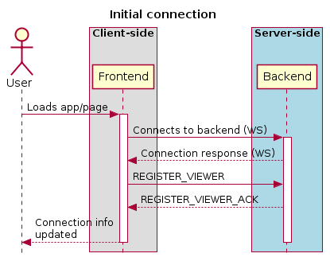
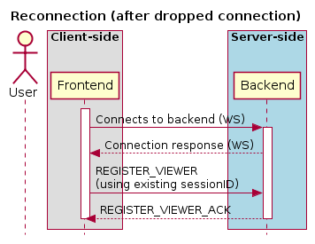
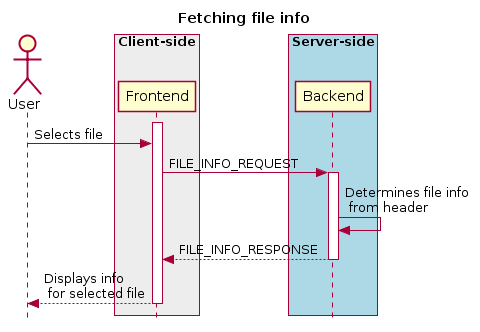
.. |image3| image:: images/image5.png
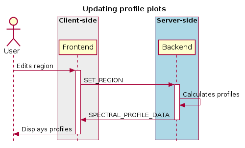
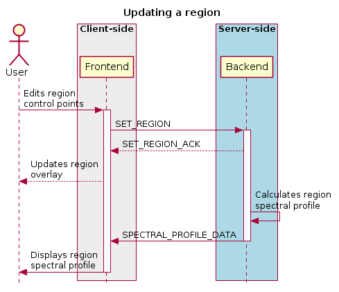
.. |image6| image:: images/image8.png
.. |image7| image:: images/image19.png
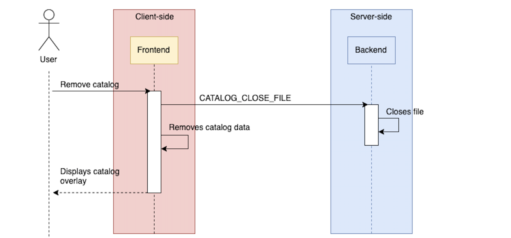
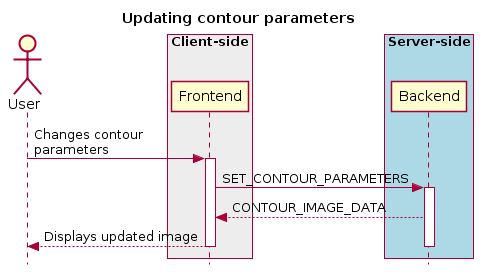
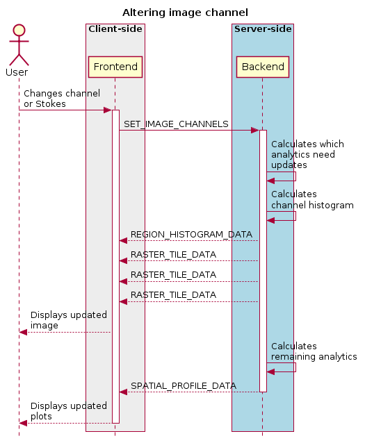
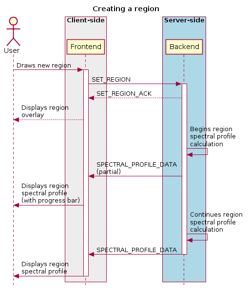
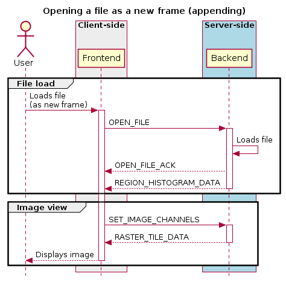
.. |image13| image:: images/image25.png
.. |image14| image:: images/image20.png
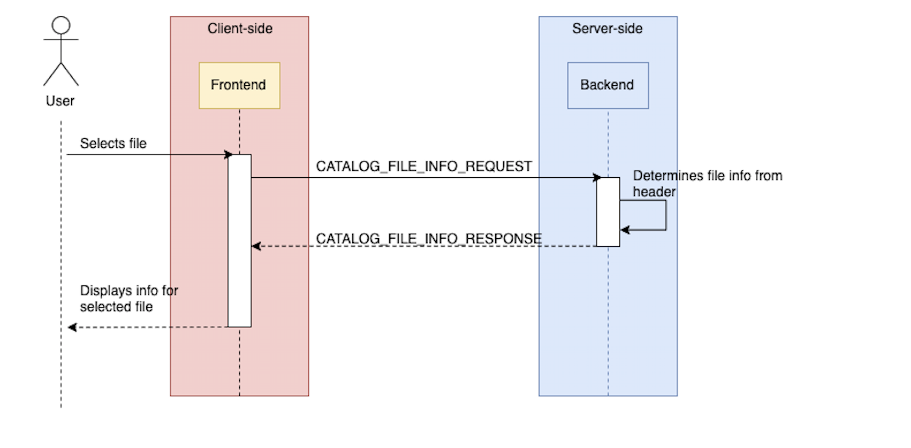
.. |image16| image:: images/image18.png
.. |image17| image:: images/image26.png
.. |image18| image:: images/image6.png
.. |image19| image:: images/image24.png
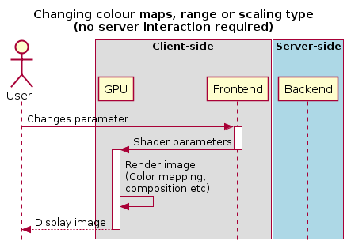
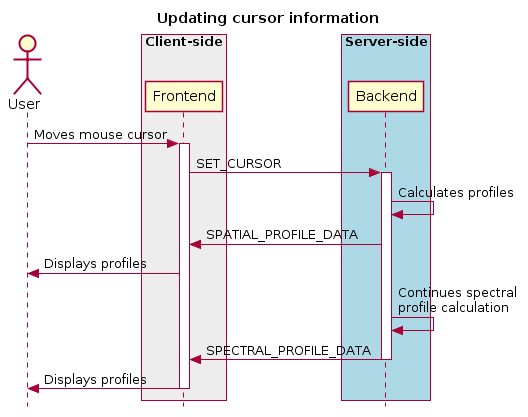
.. |image22| image:: images/image1.png
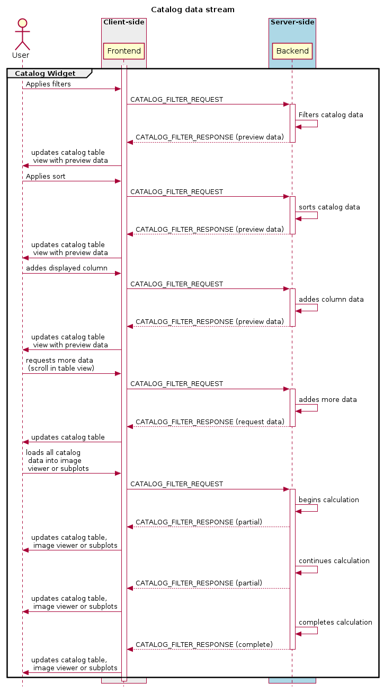
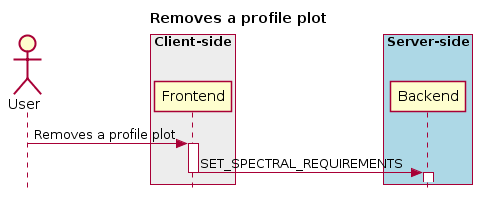

.. |image26| image:: images/image17.png
