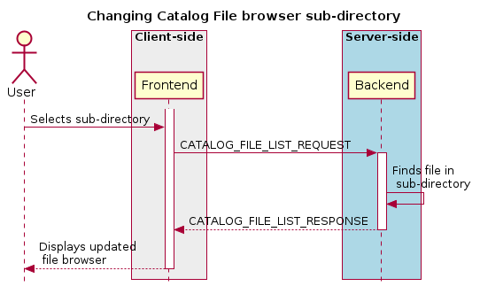

CARTA Interface Control Document
================================

Date: 19 May 2020

Authors: Angus Comrie and Rob Simmonds

Version: 15.0.0

ICD Version Integer: 15

CARTA Target: Version 1.4

**Changelog**

``0.1.7  (30/08/18):`` Added optional field ``channel_histogram_data`` to the image view message

``0.1.8  (07/09/18):`` Added ``computed_entries`` map to the File Info Extended message

``0.1.9  (10/09/18): Changed computed_entries`` map to an array of ``HeaderEntry`` messages

``0.1.10 (10/09/18):`` Added optional field ``spatial_requirements`` to the ``SET_CURSOR`` message

``0.1.11 (20/09/18):`` Added ``file_id`` field to ``SET_REGION`` and fixed control points typo

``0.1.12 (18/10/18):`` Deprecated ``channel_vals`` field in ``SPECTRAL_PROFILE_DATA``

``0.1.13 (30/11/18):`` Added details on per-cube histogram calculations

``0.1.14 (07/02/19):`` Added ``$BASE`` folder placeholder

``0.1.15 (05/03/19):`` Added target version info

``0.1.16 (25/03/19):`` Removed ``stokes``, ``channel_min`` and ``channel_max`` fields from ``SET_REGION``, and changed ``StatisticsValue`` ``value`` field to a ``double`` type.

``0.1.17 (27/03/19):`` Added ``NumPixels`` and ``NanCount`` stats types

``0.1.18 (28/03/19):`` Changed rotation units from radians to degrees

``0.2.0  (07/05/19):`` Changed message header information, adjusted stats enum values, added double value support for spectral profile

``0.2.1  (09/05/19):`` Added feature flag enums as well as event type enums. Updated animation information and sequence diagrams to include flow control

``0.2.2  (14/05/19):`` Added information on tiled rendering

``4.0.0  (02/07/19):`` Expanded sequence diagrams and text on tiled rendering and animation. Changed version numbering to match ICD version integer

``4.0.1  (04/07/19):`` Fixed incorrect sequence diagrams for file loading

``5.0.0  (15/07/19):`` Switched to byte fields instead of repeated float/double for efficiency reasons in spatial and spectral profile messages

``6.0.0  (19/07/19):`` Animation ID and timestamps for ACKs

``7.0.0  (23/07/19):`` Region file browser and import/export messages

``7.0.1  (08/08/19):`` Region export coordinate type

``8.0.0  (21/08/19):`` Added messages for retrieving and setting user preferences and layouts

``9.0.0  (17/10/19):`` Added/updated messages for contour parameters and streaming

``10.0.0 (25/10/19):`` Updated messages for contour streaming

``11.0.0 (20/11/19):`` Added messages to resume the session and its ACK

``12.0.0 (18/02/20):`` Updated messages for tiled rendering usage during animation

``13.0.0 (19/05/20):`` Updated messages for scripting service information (WIP)

``14.0.0 (28/05/20):`` Updated messages for catalogs

``15.0.0 (04/07/20):`` Added date field to file info, reordered file types alphabetically

``16.0.0 (??/07/20):`` Added sub-message for region style, replace RegionProperties with map

Introduction
============

The CARTA application is designed in a server-client model, with the backend (written in C++) communicating with the frontend (Web-based, using HTML and JavaScript web frameworks) through an interface defined in this document. While CARTA is required to support a number of file formats (FITS, CASA, HDF5 and Miriad), throughout the document, nomenclature will be defaulted to FITS files, such as when referring to multiple HDUs in a file, and header entries.

:comment:`Throughout this document, things that require some clarity, or are not finalised are commented on in this font style.`

Context
=======

There are two distinct usage scenarios for frontend-backend configuration in CARTA. Firstly, when used as a desktop application, the frontend and backend both run locally. The backend is run as an application that communicates with the frontend, which is presented to the user as a desktop application in the form of an Electron-wrapped web view [`1 <https://www.google.com/url?q=https://electronjs.org/&sa=D&ust=1596120440105000&usg=AOvVaw25RNAT6AFL3xsj2SiyIRfj>`__].

The second usage scenario is that of a remote viewer, where the backend is running on a remote server, while the frontend is loaded in the user’s browser of choice (as long as that choice is Chrome, Firefox, Safari or Edge) by visiting a URL associated with the remote server. :comment:`A third possible configuration is running the desktop Electron application, while connecting to a specific server IP for remote data. This is not a high priority, as most usage scenarios would be better handled through accessing the frontend through a remote URL.`

In both of these scenarios, communication between the frontend and backend takes place over a standard WebSocket [`2 <https://www.google.com/url?q=https://en.wikipedia.org/wiki/WebSocket&sa=D&ust=1596120440106000&usg=AOvVaw2ZlLh1OHyoKz8V-BNpFZOW>`__] communication channel, with message formats defined using protocol buffers [`3 <https://www.google.com/url?q=https://developers.google.com/protocol-buffers/&sa=D&ust=1596120440107000&usg=AOvVaw24uJRi19CVaFqiCwFz73mN>`__], based on the message structures defined in `Section 4.1 <#Application%20Layer>`__.

Image data is sent to the frontend as either uncompressed or compressed floating point data. The frontend can request which type of data is sent from the backend, which compression library to use, and what compression quality to use. Two lossy floating-point compression libraries are supported: ZFP [`4 <https://www.google.com/url?q=https://github.com/LLNL/zfp&sa=D&ust=1596120440107000&usg=AOvVaw1WlcDXStePYA7a6NmJvTTn>`__] and SZ [`5 <https://www.google.com/url?q=https://github.com/disheng222/SZ&sa=D&ust=1596120440108000&usg=AOvVaw3-guKUtEzmB9mWTEoUR62W>`__]. A general investigation of the compression performance of these two libraries shows that ZFP is consistently faster, while SZ offers slightly better compression ratios at the expense of compression and decompression speed. The current implementation of the SZ library is not thread safe, meaning that compression on the backend would have to be implemented sequentially. Note that, due to the frontend’s use of web workers to decompress data, this limitation is overcome, as each web worker operates in a separate execution space. ZFP should be preferred when network bandwidth is sufficient. In the case of a desktop application, uncompressed data or very high quality ZFP compressed data should be favoured. When using uncompressed data, the FP32 floating point data is copied directly to and from the uint8 array specified by :ref:```TileData`` <TileData>` (using 4 uint8 entries per 32-bit floating point entry).

Behaviour
=========

Connection
----------

Connection takes place via the WebSockets protocol, and is initiated as soon as the frontend page is successfully loaded. Upon connection, the frontend registers itself to the backend using the :ref:```REGISTER_VIEWER`` <RegisterViewer>` message and retrieves a new session ID, server capabilities and user preferences through :ref:```REGISTER_VIEWER_ACK`` <RegisterViewerAck>`. It then requests the list of files in the default directory. If the connection is dropped, the frontend re-registers itself to the server, but passes through the original session ID. The server should attempt to resume this session, but if not possible, will generate a new session ID for the client. In addition to the session ID, the frontend can pass through an optional API key, which can be used to determine basic permissions and user-related settings.

A connection heartbeat is established by the server-initiated ping/pong sequence defined by the WebSocket protocol. In addition to this, a client-initiated ping/pong sequence is produced by empty messages being sent by the frontend periodically. The backend keeps track of the time since each connected client last initiated the ping/pong sequence, and makes timeout decisions based on this value.

When the frontend is intentionally closed, by closing the associated app or web page, the frontend closes the WebSocket connection gracefully, and the backend can then remove the associated session. When the frontend is closed in error, or the backend determines that a connection is timed out, the backend should maintain the session for an appropriate period, so that it can be resumed when the frontend reconnects. The frontend should attempt to reconnect with the same session ID when a connection is dropped. If the backend responds with a session type set to ``RESUMED``, the frontend will attempt to resume the session by sending a list of files, along with their associated regions in a :ref:```RESUME_SESSION`` <ResumeSession>` message.

|image1|

|image2|

A scripting service is available. When enabled, the backend allows for gRPC connections on a specified port. The gRPC connection is used to simply ferry scripting commands from a scripting service, such as a python package, to the frontend. The frontend then parses the scripting commands from the incoming ``SCRIPTING_REQUEST`` message, executes the required code and responds with a ``SCRIPTING_RESPONSE`` message, which indicates the success of the scripting command, as well as the response in JSON format. Each incoming scripting request includes a unique ID, which is passed back in the scripting response, in order to uniquely match scripting requests to their responses.

File browsing
-------------

The file browser displays a list of files in the selected directory, along with some basic information on each file (type, size) and a list of subdirectories. If a file contains multiple HDUs (or equivalent), a list of HDU names is included. If a file is selected in the file browser, additional information is shown. A specific HDU of a file can be selected. When a subdirectory is selected, the file list is fetched for that subdirectory. When a file is loaded, the default image view is requested. A file can be loaded as a raster or contour image (not currently implemented), and can be appended to the current list of open files, or can replace all open files, in which case the frontend must first close all files using the :ref:```CLOSE_FILE`` <CloseFile>` message with ``file_id = -1``. Individual open files can be removed from the file list by calling :ref:```CLOSE_FILE`` <CloseFile>` with an appropriate ``file_id`` field.

|image3|

|image4|

|image5|

|image6|

Data cube navigation
--------------------

The frontend can change the displayed channel and Stokes parameter by issuing the :ref:```SET_IMAGE_CHANNELS`` <SetImageChannels>` command. When an image is opened, the frontend will send a :ref:```SET_IMAGE_CHANNELS`` <SetImageChannels>` with the first channel and Stokes parameter. The frontend subscribes to all :ref:```RASTER_TILE_DATA`` <RasterTileData>` messages.

Tiled rendering splits the image into individual square tiles (defaulting to 256 pixels in width), and renders the image progressively as tiles arrive from the backend. This is more efficient when exploring a large image, as it reuses data when panning and zooming around the image. Images are downsampled by a power of 2.

In addition, contour rendering can be used on files. The contours for an entire channel are generated when the frontend sends the :ref:```SET_CONTOUR_PARAMETERS`` <SetContourParameters>` command. The frontend subscribes to all :ref:```CONTOUR_IMAGE_DATA`` <ContourImageData>` messages. Currently, contour renders are automatically updated when the user changes channel or plays an animation. Contours are delivered in separate chunks by the backend, so that the user can see the contours as they are delivered to the frontend, and can get an idea of how long the contour fetching will take.

Zooming and panning
~~~~~~~~~~~~~~~~~~~

The frontend can request specific tiles of an image to be delivered. Tiles are specified using the widely used a `tiled web map <https://www.google.com/url?q=https://en.wikipedia.org/wiki/Tiled_web_map&sa=D&ust=1596120440114000&usg=AOvVaw2AQmAKZszSBjzBjevxXR-M>`__ convention (commonly used in GIS and online image viewer software). Each tile is defined by three coordinates: The layer, x and y coordinates. The zeroth layer consists of the entire image, down-sampled until it is stored in a single tile, with both width and height less than or equal to a chosen tile size (defaulting to 256 pixels, but this may increase in future to 512 pixels for large format screens). The tile size must be a multiple of four, due to the ZFP algorithm’s block size. Each subsequent layer doubles in width and height, to the point where the highest layer (*N*) contains the entire image in full resolution, split into fixed-size tiles (tiles along the right and top edges of the image will have reduced width and height respectively).

Tile coordinates (``layer``, ``x`` and ``y``) are encoded into a single 32-bit integer before sending. There are two primary reasons for this:

-  Using a struct as a key in a map on either frontend or backend would be more complicated, and require a custom hash function. JavaScript ``Map`` objects do not support this. Storing tiles within a map-of-maps-of-maps would be less efficient.
-  Encoding and decoding an array of structs in a protocol buffer object would be less efficient in terms of CPU time and network storage

The encoded integer consists of:

-  12 bits for the X and Y coordinate. This limits the implementation to at most 4096 tiles along either axis. With a default tile size of 256 pixels, this means images must be smaller than 1.04 million pixels in width and height.
-  7 bits for the layer coordinate. This limits the implementation to 128 layers. However, this limitation is artificial, since at most 12 layers will be required, given the above limitation of 4096 tiles
-  1 bit left over, because JavaScript bit shifting is done on signed integers, rather than unsigned

Encoding and decoding is a simple and lightweight process using some bit shifting. A single line JavaScript function to encode is:

``(x, y, layer) => (layer << 24) | (y << 12) | x;``

When a user zooms or pans, the frontend sends the :ref:```ADD_REQUIRED_TILES`` <AddRequiredTiles>` command to the backend. The frontend may debounce, throttle or delay sending tiles to the backend, in order to optimise delivery and avoid sending stale tiles. The order of the list of tiles supplied to :ref:```ADD_REQUIRED_TILES`` <AddRequiredTiles>` determines the order in which the backend delivers tiles. If subsequent :ref:```ADD_REQUIRED_TILES`` <AddRequiredTiles>` messages arrive while the backend is still delivering tiles, the most recent tile list is prioritised.

Another route for optimisation available to the frontend is :ref:```REMOVE_REQUIRED_TILES`` <RemoveRequiredTiles>`, which allows the frontend to explicitly indicate that certain tiles are no longer required. If any of these tiles are yet to be delivered to the frontend, the backend can optimise tile delivery by removing them from the queue of titles to be delivered.

Tile data is delivered by the backend using the :ref:```RASTER_TILE_DATA`` <RasterTileData>` stream. This allows the backend to send one or more raster tiles with the same compression format and quality to the frontend. Each time a tile is delivered to the frontend, the image is re-rendered.

|image7|

Channel navigation
~~~~~~~~~~~~~~~~~~

When changing channels via a :ref:```SET_IMAGE_CHANNELS`` <SetImageChannels>` message, the frontend includes an initial list of required tiles. These tiles are then delivered individually by the backend. Unlike the case when zooming and panning, the frontend will wait for all required tiles to be delivered before displaying an image when switching channels. When receiving a :ref:```SET_IMAGE_CHANNELS`` <SetImageChannels>` message, the backend will also send the new channel histogram via the :ref:```REGION_HISTOGRAM_DATA`` <RegionHistogramData>` stream.

In general, one image view command will correspond to a subsequent image data stream message. However, changing the image channel will result in a subsequent image data stream message, as well as any relevant updated statistics, histograms or profile data.

|image8|

Animation
~~~~~~~~~

An animation can be played back by issuing the :ref:```START_ANIMATION`` <StartAnimation>` command. This command encapsulates all the different animation stepping and bounds parameters, in order to allow the backend to perform frame calculations and deliver image data to the front. After the the :ref:```START_ANIMATION`` <StartAnimation>` command has been issued, the backend sends images and analysis results to the frontend at a regular interval. When the user stops an animation, the frontend sends the :ref:```STOP_ANIMATION`` <StopAnimation>` command, which includes information on the current image’s channels, so that the backend can be sure that the frontend channel state is the same as that of the backend. If the last sent frame does match the frontend channel state, the backend adjusts channels again. In order to prevent the backend from sending too many animation frames, some basic flow control is provided through :ref:```ANIMATION_FLOW_CONTROL`` <AnimationFlowControl>` message. This is sent from the frontend to the backend to indicate the latest frame received, preventing the backend from queuing up too many frames. The :ref:```START_ANIMATION`` <StartAnimation>` command includes an :ref:```ADD_REQUIRED_TILES`` <AddRequiredTiles>` sub-message, specifying the required tiles and compression type to be used in the animation. The backend includes an animation ID field in :ref:```START_ANIMATION_ACK`` <StartAnimationAck>` in order to allow the frontend to differentiate between frames of previous animations and the latest animation.

|image9|

Images are sent as tiled data. In order to keep the image view channel and full image histogram synchronised, the ``RASTER_IMAGE_DATA`` message includes a :ref:```REGION_HISTOGRAM_DATA`` <RegionHistogramData>` object, containing the channel histogram for the new channel. During animation playback, each animation step will result in image data stream messages, as well as any relevant analytics updates. If zooming or panning occurs during animation, a ``SET_IMAGE_VIEW`` message is sent to the backend, updating the view bounds. These new bounds are used in the next frame generated by the backend.

Changing view parameters
------------------------

Contours must be re-calculated by the server when the contour parameters (levels, mode or smoothness) change.

|image10|

However, as contour rendering is done on the frontend, any changes to the contour rendering configuration (visibility, opacity, thickness, colour, line style) do not require any server interaction. Similarly for raster images: As all the rendering is done on the frontend, any changes to the raster rendering configuration (colour map, range, scaling type) do not require any interaction between frontend and backend:

|image11|

Region selection and statistics
-------------------------------

Region creation
~~~~~~~~~~~~~~~

Regions can be created, removed and updated. Any profiles or statistics data associated with a region flow from the backend to the server whenever an update is required. Updates may be required (a) when a region is created or updated; (b) when the image channel is explicitly switched to a different channel or Stokes parameter using :ref:```SET_IMAGE_CHANNELS`` <SetImageChannels>` or (c) when an animation playback results in the image view being updated implicitly.

In addition, the backend may choose to provide partial region statistics or profile updates if the calculations are time-intensive. When creating a region, the ``region_id`` field of :ref:```SET_REGION`` <SetRegion>` is less than zero: the backend generates the unique region_id field, and returns it in the acknowledgement message.

|image12|

|image13|

Cursor updates
~~~~~~~~~~~~~~

As viewing profiles based on the position of the cursor is a very common use case, a separate control message is used specifically for this purpose, and does not require the definition of any additional region. The cursor-based region has a ``region_id`` field value of zero, and is defined as a point-type region. The X and Y coordinates of the region can only be updated via the :ref:```SET_CURSOR`` <SetCursor>` command, while the channel and Stokes coordinates are automatically updated by the backend whenever the image view is changed.

|image14|

Region requirements
~~~~~~~~~~~~~~~~~~~

Each region can have analytical data requirements associated. For example, the user may wish to display the Z-profile of a particular region, while displaying the X- and Y-profiles of the cursor region. Whenever an analytical widget is added or removed in the frontend, the frontend must update the requirements associated with that region using the relevant command:

-  ``SET_SPECTRAL_REQUIREMENTS`` for spectral profiler widgets
-  ``SET_SPATIAL_REQUIREMENTS`` for spatial profiler widgets
-  ``SET_STATS_REQUIREMENTS`` for stats info displays
-  ``SET_HISTOGRAM_REQUIREMENTS`` for histograms plot widgets

After each requirements update, the backend should then assess the new requirements to determine whether any new or updated analytical data needs to be sent to the frontend. As an example: adding a spectral profile widget on the frontend and setting its requirements will mean that the region it is associated with now has an additional requirement, and the frontend requires new data. As such, the backend will calculate the required spectral profile and send it using :ref:```SPECTRAL_PROFILE_DATA`` <RegionStatsData>`. However, removing the spectral profile widget on the frontend will now remove that requirement, but no new :ref:```SPECTRAL_PROFILE_DATA`` <RegionStatsData>` message is needed from the frontend.

|image15|

|image16|

If a region’s parameters are changed, the backend determines which calculations need to be updated, based on the region’s requirements set, and any required data is sent to the frontend through a new data stream message:

|image17|

When all files are closed, regions associated with that file are removed, both on the frontend and on the backend. When only a single frame is closed, the regions persist.

|image18|

Per-cube histograms
~~~~~~~~~~~~~~~~~~~

As users may wish to use a histogram generated from the entire cube to choose their render bounds, the backend needs to support the calculation of a histogram on a per-cube as well as per-slice basis. A per-cube histogram is requested through the :ref:```SET_HISTOGRAM_REQUIREMENTS`` <SetHistogramRequirements>` message, with the region ID set to -2. As per-cube histograms may take a long time to calculate, there are additional requirements over and above per-slice histograms.

The backend should deliver results from the histogram calculation at regular intervals. As the histogram. As the histogram calculation consists of a large number of separable calculations (reading through individual slices to determine min/max, reading through individual slices to fill the histogram bins), the backend can split the calculation up into smaller tasks, and deliver cumulative results to the frontend.

|image19|

The backend should be able to cancel the histogram calculation when receiving a specific message from the frontend. By sending a second :ref:```SET_HISTOGRAM_REQUIREMENTS`` <SetHistogramRequirements>` message to the backend, with the region ID set to -2 and an empty histogram list, the frontend can indicate to the backend that the per-cube histogram is no longer required, and the backend can cancel the calculation.

|image20|

Data streaming
--------------

While some data flows can be described by a simple request/response approach, such as retrieving file lists or file information, other data flows require an asynchronous data stream approach. This need arises from situations where a single state change command corresponds to more than one response from the backend. For example, changing image channel would require each spatial profile associated with the active image channel to be updated, possibly resulting in more than one :ref:```SPATIAL_PROFILE_DATA`` <SpatialProfileData>` messages. Moving a region would require updating any analytics associated with the region. It is the backend’s responsibility to correctly determine which analytic data needs to be updated whenever a control message is sent. It is essential that the backend only recalculates and sends data when needed. In order to do this, the backend must keep track of any updates to region requirements, and use these requirements to determine whether updates are needed. Region requirements will reflect the current frontend UI configuration. Changes to the frontend UI configuration (such as changing between “average” and “max” on a spectral profile widget) will result in new region requirements being sent to the backend, which will then be processed, resulting in new data being sent to the frontend when required.

Some examples of possible resultant data streams for control messages are given below:

-  :ref:```SET_IMAGE_CHANNELS`` <SetImageChannels>`: Changing either the channel or the Stokes parameter would require new image data to be sent, for both raster and contour images. Changing from one channel to another in the same Stokes cube could result in histograms, spatial profiles or region stats to require updating. Changing to a new stokes cube could also require spectral profiles to be updated. These updates will depend on the defined regions and defined region requirements.
-  :ref:```START_ANIMATION`` <StartAnimation>`: Starting an animation will require new image data for each frame. In addition, since the animation playback may be across file, Stokes or channel parameters, the same data streams as those arising from :ref:```SET_IMAGE_CHANNELS`` <SetImageChannels>` can occur.
-  :ref:```SET_CURSOR`` <SetCursor>`: Updating the cursor position is a special case of updating a region. As the cursor position is a point region, only spectral data and spatial data can require an update.
-  :ref:```SET_REGION`` <SetRegion>`: Creating a region will not result in any data streams, as the region’s requirements will be empty by default. However, updating a regions parameters (other than region name) could result in spatial profiles (for open regions), spectral profiles, region stats and histograms (for closed and point regions) to be updated.
-  :ref:```SET_STATS_REQUIREMENTS`` <SetStatsRequirements>`: Updating stats requirements for a region can result in region stats data being updated.
-  :ref:```SET_HISTOGRAM_REQUIREMENTS`` <SetHistogramRequirements>`: Updating histogram requirements for a region (either by updating the channel required for the histogram or by changing the histogram bin number) can result in histogram data being updated.
-  :ref:```SET_SPATIAL_REQUIREMENTS`` <SetSpatialRequirements>`: Updating spatial profile requirements for a region can result in spatial profile data being updated.
-  :ref:```SET_SPECTRAL_REQUIREMENTS`` <SetSpectralRequirements>`: Updating spectral profile requirements for a region (either by changing the coordinate required, such as “Qz” or “Uz”, or by changing the statistic type used to generate the profile) can result in spectral profile data being updated.
-  :ref:```SET_CONTOUR_PARAMETERS`` <SetContourParameters>`: Updating contour parameters for a file will result in new contour image data being required.

User preferences
----------------

If the backend supports the :ref:```USER_PREFERENCES`` <ServerFeatureFlags>` server feature flag, the frontend will expect all the user’s preferences (default settings, color maps, interaction preferences and others) to be included in the :ref:```REGISTER_VIEWER_ACK`` <RegisterViewerAck>` message. Changes to the user preferences can be made by the frontend through the :ref:```SET_USER_PREFERENCES`` <SetUserPreferences>` control message. Each preference to be updated, along with the updated value, is stored as a map. User preference entries can be removed from the server by sending a :ref:```SET_USER_PREFERENCES`` <SetUserPreferences>` message with a map of preference keys with empty values.

If the backend supports the :ref:```USER_LAYOUTS`` <ServerFeatureFlags>` server feature flag, the frontend will expect all the user’s custom UI layouts to be included in the :ref:```REGISTER_VIEWER_ACK`` <RegisterViewerAck>` message. Changes to individual layouts (adding, updating or removing) are updated through the :ref:```SET_USER_LAYOUT`` <SetUserLayout>` control message.

Resume the session
------------------

The basic idea is that, when the frontend reconnects to the backend (with :ref:```REGISTER_VIEWER`` <RegisterViewer>`), it would also send some state information, such as:

-  list of open files, along with their IDs and the current channels and stokes
-  list of regions for each file, along with all their properties

Users can choose whether to resume the session while reconnected. If yes, then the backend would then reconstruct the session based on the frontend's message, by opening files again, changing to the appropriate channels, and so on, and then adding the regions and then set requirements.

There are two use cases for resuming with an existing session ID, and a third where resume is not possible.

#. Backend is restarted, frontend connects, frontend sends state information.

   #. Frontend sends :ref:```REGISTER_VIEWER`` <RegisterViewer>` with session_id > 0.
   #. Restarted backend has no session_ids, :ref:```REGISTER_VIEWER_ACK`` <RegisterViewerAck>` sets session_type=RESUMED\ *.* Backend creates new Session with given session_id (On Connect).
   #. Frontend sends state to backend, i.e., sends :ref:```RESUME_SESSION`` <ResumeSession>` message with state information, backend responds with :ref:```RESUME_SESSION_ACK`` <ResumeSessionAck>`.
   #. Backend sets state in newly-created Session.

#. Network connection drops, frontend reconnects to backend with existing session id.

   #. While the network connection drops. It seems the uWebsocket has a default timeout setting for 15,000 ms (need to verify). For the new version of uWebsocket, we can set the timeout via the variable “\ *.idleTimeout”*. On Disconnect is called after the timeout and then backend deletes Session.
   #. Frontend sends :ref:```REGISTER_VIEWER`` <RegisterViewer>` with session_id > 0.
   #. Backend has session_id, :ref:```REGISTER_VIEWER_ACK`` <RegisterViewerAck>` sets session_type=RESUMED. Frontend sends state to backend with :ref:```RESUME_SESSION`` <ResumeSession>`, and backend responses with :ref:```RESUME_SESSION_ACK`` <ResumeSessionAck>`.
   #. Backend sets state in existing Session, requirements trigger sending data streams (possibly cached).

#. Frontend is restarted, has no existing session id so cannot resume even though backend continues.

   #. Frontend sends :ref:```REGISTER_VIEWER`` <RegisterViewer>` with session_id = 0.
   #. Backend creates a new Session, :ref:```REGISTER_VIEWER_ACK`` <RegisterViewerAck>` sets session_type=NEW.
   #. The Session will be deleted immediately while the frontend is restarted.

Catalog overlay
---------------

Sequence Diagrams
~~~~~~~~~~~~~~~~~

#. Catalog file list\ |image21|
#. Catalog file info\ |image22|
#. Opening catalog file\ |image23|
#. Catalog file data stream\ |image24|
#. Closing catalog file\ |image25|

Moments generator
-----------------

The moment generator should allow users to generate moment images from a cube interactively with the GUI. The interactivity should happen with a spectral line profile plot as usually we need information from spectral line profiles (line spectral/intensity distributions) to decide the control parameters of the moment generator. This could happen with the existing spectral profile widget, or, with a dedicated moment generator widget/dialogue with a spectral line profile plot.

CARTA should provide the following kinds of moments (sensible name in bold) as supported by CASA:

-  moments = -1 - **mean value of the spectrum**
-  moments = 0 - **integrated value of the spectrum**
-  moments = 1 - **intensity weighted coordinate**; traditionally used to get "velocity fields"
-  Moments = 2 - **intensity weighted dispersion of the coordinate**; traditionally used to get "velocity dispersion"
-  moments = 3 - **median value of the spectrum**
-  moments = 4 - **median coordinate**
-  moments = 5 - **standard deviation about the mean of the spectrum**
-  moments = 6 - **root mean square of the spectrum**
-  moments = 7 - **absolute mean deviation of the spectrum**
-  moments = 8 - **maximum value of the spectrum**
-  moments = 9 - **coordinate of the maximum value of the spectrum**
-  moments = 10 - **minimum value of the spectrum**
-  moments = 11 - **coordinate of the minimum value of the spectrum**

The newly generated moment images (multiple moments can be generated at the same time) should be loaded and appended (and match spatially) in CARTA. CARTA should also support the capability to export the images as files in the following formats:

-  CASA image format
-  FITS image format
-  HDF5-IDIA schema image format (TBD; post v1.4)

We create temporary moment images in the backend. Then if users want to keep the results, the “save image” option in the file menu should be used where filename and file type can be defined. If users don’t do the “save image” step, those images should be deleted when the session is closed.

The interactivity with the spectral profile widget should include the following:

#. Text fields to specify spectral ranges to generate moments. This includes:

-  Channel
-  Velocity
-  Frequency
-  Stokes

These text fields (except Stokes) are linked to the selection via the cursor directly on the spectral plot. Users can drag on the spectral plot to define a range in the spectral axis.

2. Text fields to define masks for the intensity values. Users can define a range of intensity values to be included in the moment calculations. For example, usually we will apply a threshold (e.g., >= 5-sigma) to the cube to compute moment 1 and moment 2. These text fields are linked to the selection via the cursor directly on the spectral plot. Users can drag on the spectral plot to define thresholds for moments.

As image cubes might be extremely large, the moment generator in CARTA should support an accurate progress bar (CASA provides "multiple" 0-100% progress bars which is misleading and does not provide useful information) and most importantly, the ability of cancellation.

Sequence diagrams for setting image moments and stopping moments calculation are shown below:

|image26|

|image27|

Layer descriptions
==================

Application Layer
-----------------

Interface communication messages fall into three overall categories:

-  **Control messages** (along with any associated acknowledgement responses), which are used to modify the state of the backend from the frontend. Example of this would be starting a new session, moving the cursor or updating region parameters. Each message from the frontend correspond to zero or one acknowledgement response from the backend. Message names for this category follow the naming convention :f2b:```MESSAGE_NAME``` and :b2f:```MESSAGE_NAME_ACK```
-  **Request messages** (along with the required responses), which are used to explicitly request information from the backend without explicitly changing the backend state. Examples of this would be requesting a file list. The frontend will wait for a response for each request of this type, and callbacks or promises will be used to execute code based on the returned response. As each request needs to be mapped to response, messages in this category must include a unique requestID entry. Each message from the frontend in this category corresponds to exactly one response from the backend. Message names for this category follow the naming convention :f2b:```MESSAGE_NAME_REQUEST``` and :b2f:```MESSAGE_NAME_RESPONSE```
-  **Data flow messages**, which flow from the backend to the frontend without an originating front end request. These messages are used for pushing updated data from the backend to the frontend. Examples of this type would be image data, region statistics, profile data and cursor values. The appropriate mechanism for dealing with these messages in the frontend is a observable/subscription-based approach. As there is no request/response combination for messages in this category, there is no prescribed message naming convention.

**Implementation note:** The backend should implement a command queue for control messages, so that high priority messages are executed first, and cause the backend to disregard any queued-up control messages that are no longer relevant. As an example: moving the cursor across the image will result in a large number of control messages being sent to the backend. Each of these control messages could result in a data flow message with new cursor and profile information, which may take some time to calculate. If a file is closed by the frontend, the backend no longer needs to process any remaining cursor messages relating to this file, and those messages should be removed from the queue.

**Message definitions shown in** :f2b:`blue`\ **are used for frontend ->backend communication. Message definitions shown in** :b2f:`red` **are used for backend->frontend communication.**

Control messages
~~~~~~~~~~~~~~~~

Request messages
~~~~~~~~~~~~~~~~

Data stream messages
~~~~~~~~~~~~~~~~~~~~

Sub-messages
~~~~~~~~~~~~

Enums
~~~~~

Presentation layer
------------------

Messages are encoded using the Protocol Buffers message format, which encodes into a binary format. Each message is prepended by a 64-bit structure, consisting of:

-  16-bit unsigned integer, used to identify the message type, specified by :ref:`EventType <EventType>`
-  16-bit unsigned integer, used to determine the ICD version
-  32-bit unsigned integer, used to uniquely identify requests and corresponding responses. In the case of messages with no corresponding request, such as data stream messages, this integer will be ignored.

Using an 8-byte header prevents byte alignment issues from cropping up. End points decode the message by splitting it into two sections: the 8-byte identifier header and the payload. The identifier header is used to determine which Protocol Buffer definition should be used to decode the payload, and which request corresponds to which response. The ICD version integer (shown at the top of this document) should match the major version of this document (also shown at the top of this document). Any changes to the protocol buffer definitions that would render older backend or frontend implementations incompatible should result in incrementing the ICD version number, and a corresponding change to this document’s version number.

**Implementation note:** The protocol buffer style guide [`6 <https://www.google.com/url?q=https://developers.google.com/protocol-buffers/docs/style&sa=D&ust=1596120441262000&usg=AOvVaw227yzAAb6mADmHP-ujYzuU>`__] expects snake_case for field names. The protobuf c++ compiler leaves names in snake_case, while the javascript compiler leaves field names in camelCase. So a field accessed via ``msg.min_val() in c++`` would be accessed by ``msg.minVal`` in javascript.

Session Layer
-------------

Sessions will utilise the the WebSocket protocol, as the frontend will be browser-based. Initial session establishment will occur using HTTP, and then be upgraded to WebSocket. Session management will be handled by a session ID being passed from backend to frontend on initial connection. If the frontend is disconnected without closing the session explicitly, the session ID can be passed to the backend upon reconnection to resume the session, although this is not currently supported.

Transport Layer
---------------

The interface will use TCP to communicate. Network layer and below will be dependent on the server/client connection and need not be detailed.


.. |image5| image:: _static/opening_a_file_as_a_new_frame_appending.png





