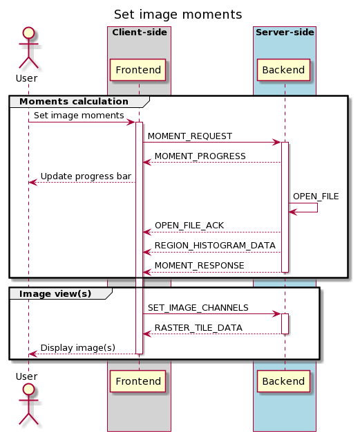
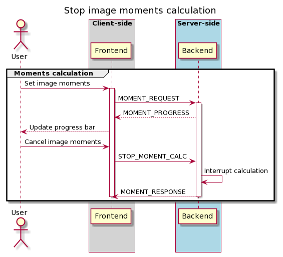

.. _moments-generator:

Moments generator
-----------------

The moment generator should allow users to generate moment images from a cube interactively with the GUI. The interactivity should happen with a spectral line profile plot as usually we need information from spectral line profiles (line spectral/intensity distributions) to decide the control parameters of the moment generator. This could happen with the existing spectral profile widget, or, with a dedicated moment generator widget/dialogue with a spectral line profile plot.

CARTA should provide the following kinds of moments (sensible name in bold) as supported by CASA:

-  moments = -1 - **mean value of the spectrum**
-  moments = 0 - **integrated value of the spectrum**
-  moments = 1 - **intensity weighted coordinate**; traditionally used to get "velocity fields"
-  Moments = 2 - **intensity weighted dispersion of the coordinate**; traditionally used to get "velocity dispersion"
-  moments = 3 - **median value of the spectrum**
-  moments = 4 - **median coordinate**
-  moments = 5 - **standard deviation about the mean of the spectrum**
-  moments = 6 - **root mean square of the spectrum**
-  moments = 7 - **absolute mean deviation of the spectrum**
-  moments = 8 - **maximum value of the spectrum**
-  moments = 9 - **coordinate of the maximum value of the spectrum**
-  moments = 10 - **minimum value of the spectrum**
-  moments = 11 - **coordinate of the minimum value of the spectrum**

The newly generated moment images (multiple moments can be generated at the same time) should be loaded and appended (and match spatially) in CARTA. CARTA should also support the capability to export the images as files in the following formats:

-  CASA image format
-  FITS image format
-  HDF5-IDIA schema image format (TBD; post v1.4)

We create temporary moment images in the backend. Then if users want to keep the results, the “save image” option in the file menu should be used where filename and file type can be defined. If users don’t do the “save image” step, those images should be deleted when the session is closed.

The interactivity with the spectral profile widget should include the following:

#. Text fields to specify spectral ranges to generate moments. This includes:

-  Channel
-  Velocity
-  Frequency
-  Stokes

These text fields (except Stokes) are linked to the selection via the cursor directly on the spectral plot. Users can drag on the spectral plot to define a range in the spectral axis.

2. Text fields to define masks for the intensity values. Users can define a range of intensity values to be included in the moment calculations. For example, usually we will apply a threshold (e.g., >= 5-sigma) to the cube to compute moment 1 and moment 2. These text fields are linked to the selection via the cursor directly on the spectral plot. Users can drag on the spectral plot to define thresholds for moments.

As image cubes might be extremely large, the moment generator in CARTA should support an accurate progress bar (CASA provides "multiple" 0-100% progress bars which is misleading and does not provide useful information) and most importantly, the ability of cancellation.

Sequence diagrams for setting image moments and stopping moments calculation are shown below:

