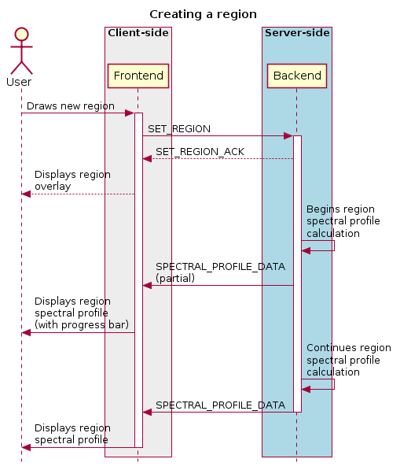
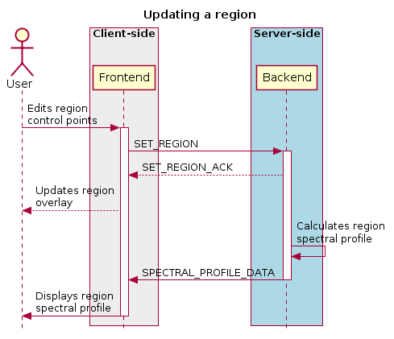
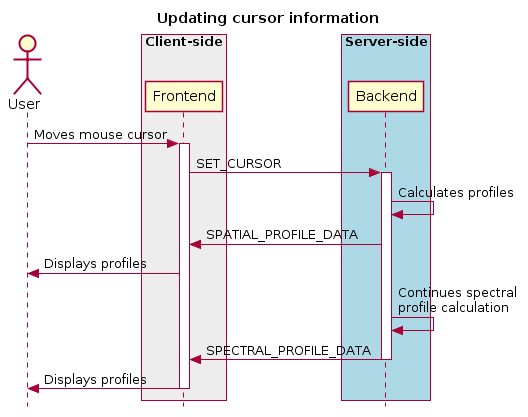
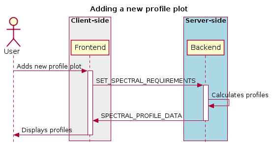
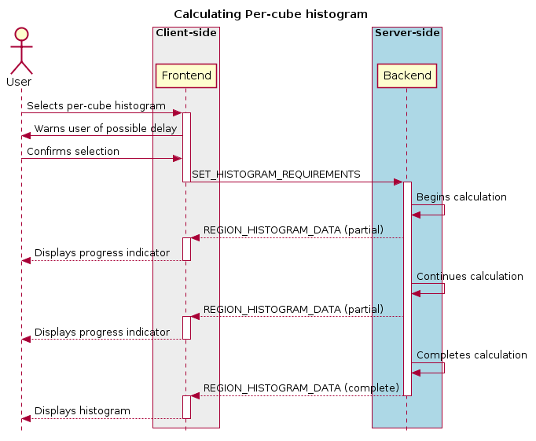
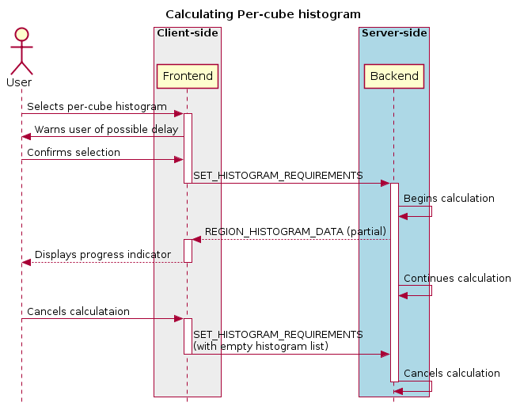

Region selection and statistics
-------------------------------

Region creation
~~~~~~~~~~~~~~~

Regions can be created, removed and updated. Any profiles or statistics data associated with a region flow from the backend to the server whenever an update is required. Updates may be required (a) when a region is created or updated; (b) when the image channel is explicitly switched to a different channel or Stokes parameter using :ref:```SET_IMAGE_CHANNELS`` <SetImageChannels>` or (c) when an animation playback results in the image view being updated implicitly.

In addition, the backend may choose to provide partial region statistics or profile updates if the calculations are time-intensive. When creating a region, the ``region_id`` field of :ref:```SET_REGION`` <SetRegion>` is less than zero: the backend generates the unique region_id field, and returns it in the acknowledgement message.





Cursor updates
~~~~~~~~~~~~~~

As viewing profiles based on the position of the cursor is a very common use case, a separate control message is used specifically for this purpose, and does not require the definition of any additional region. The cursor-based region has a ``region_id`` field value of zero, and is defined as a point-type region. The X and Y coordinates of the region can only be updated via the :ref:```SET_CURSOR`` <SetCursor>` command, while the channel and Stokes coordinates are automatically updated by the backend whenever the image view is changed.



Region requirements
~~~~~~~~~~~~~~~~~~~

Each region can have analytical data requirements associated. For example, the user may wish to display the Z-profile of a particular region, while displaying the X- and Y-profiles of the cursor region. Whenever an analytical widget is added or removed in the frontend, the frontend must update the requirements associated with that region using the relevant command:

-  ``SET_SPECTRAL_REQUIREMENTS`` for spectral profiler widgets
-  ``SET_SPATIAL_REQUIREMENTS`` for spatial profiler widgets
-  ``SET_STATS_REQUIREMENTS`` for stats info displays
-  ``SET_HISTOGRAM_REQUIREMENTS`` for histograms plot widgets

After each requirements update, the backend should then assess the new requirements to determine whether any new or updated analytical data needs to be sent to the frontend. As an example: adding a spectral profile widget on the frontend and setting its requirements will mean that the region it is associated with now has an additional requirement, and the frontend requires new data. As such, the backend will calculate the required spectral profile and send it using :ref:```SPECTRAL_PROFILE_DATA`` <RegionStatsData>`. However, removing the spectral profile widget on the frontend will now remove that requirement, but no new :ref:```SPECTRAL_PROFILE_DATA`` <RegionStatsData>` message is needed from the frontend.



.. image:: images/removes_a_profile_plot.png

If a region’s parameters are changed, the backend determines which calculations need to be updated, based on the region’s requirements set, and any required data is sent to the frontend through a new data stream message:

.. image:: images/updating_profile_plots.png

When all files are closed, regions associated with that file are removed, both on the frontend and on the backend. When only a single frame is closed, the regions persist.

.. image:: images/closing_a_file.png

Per-cube histograms
~~~~~~~~~~~~~~~~~~~

As users may wish to use a histogram generated from the entire cube to choose their render bounds, the backend needs to support the calculation of a histogram on a per-cube as well as per-slice basis. A per-cube histogram is requested through the :ref:```SET_HISTOGRAM_REQUIREMENTS`` <SetHistogramRequirements>` message, with the region ID set to -2. As per-cube histograms may take a long time to calculate, there are additional requirements over and above per-slice histograms.

The backend should deliver results from the histogram calculation at regular intervals. As the histogram. As the histogram calculation consists of a large number of separable calculations (reading through individual slices to determine min/max, reading through individual slices to fill the histogram bins), the backend can split the calculation up into smaller tasks, and deliver cumulative results to the frontend.



The backend should be able to cancel the histogram calculation when receiving a specific message from the frontend. By sending a second :ref:```SET_HISTOGRAM_REQUIREMENTS`` <SetHistogramRequirements>` message to the backend, with the region ID set to -2 and an empty histogram list, the frontend can indicate to the backend that the per-cube histogram is no longer required, and the backend can cancel the calculation.



